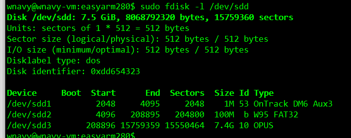

# 再谈SD卡分区与引导

## 准备

* `扇区大小`:SD卡的扇区大小一般为`512`字节, SD卡的分区都是以扇区为单位的

从之前的文章 [EasyArm_IMX280A_SD分区详解.pdf](../EasyArm_IMX280A_SD分区详解.pdf) 我们已经知道了, 要想从SD卡启动, 该SD卡必须使用`MBR`格式的分区表, `MBR`记录了该SD上各个分区的地址, 大小和文件系统类型等信息。其中, 启动分区的`文件系统标志`必须为`0x53`。

在启动分区的第一个扇区的开始位置必须包含`BCB(Boot Control Block)`数据, 该`BCB`数据指明了启动镜像(`u-boot.sb`)的地址和大小。

在Windows下使用`cfimager.exe`制作SD卡启动盘的时候, 改工具自动帮我们在SD卡上创建了3个分区：

* 一个FAT32分区(`10`), 用于存放`uImage`, `zImage`和设备树文件;
* 一个`rootfs`分区(`b`), 用于存放根文件系统;
* 一个`uboot`分区(`53`), 用于存放``BCB`和`u-boot.sb`镜像, 该分区为启动引导分区(`0x53`);

那么我们可不可以自己手动给SD分区, 制作可启动的SD卡呢？当然是可以的, 在linux系统上, 只需要使用`fdisk`, `mkfs`, `dd`, `mxsboot(uboot自带的tools)`这几个工具就可以制作一个可启动的SD卡。

## 如何分区

> u-boot默认的启动参数如下(`printenv`,已忽略nand部分):

```bash
baudrate=115200
boot_fdt=try
bootcmd=mmc dev ${mmcdev}; if mmc rescan; then if run loadbootscript; then run bootscript; else if run loadimage; then run mmcboot; else run netboot; fi; fi; else run netboot; fi
bootscript=echo Running bootscript from mmc ...; source
console_mainline=ttyAMA0
fdt_addr=0x41000000
fdt_file=imx28-evk.dtb
image=zImage
loadaddr=0x42000000
loadbootscript=fatload mmc ${mmcdev}:${mmcpart} ${loadaddr} ${script};
loadfdt=fatload mmc ${mmcdev}:${mmcpart} ${fdt_addr} ${fdt_file}
loadimage=fatload mmc ${mmcdev}:${mmcpart} ${loadaddr} ${image}
mmcargs=setenv bootargs console=${console_mainline},${baudrate} root=${mmcroot}
mmcboot=echo Booting from mmc ...; run mmcargs; if test ${boot_fdt} = yes || test ${boot_fdt} = try; then if run loadfdt; then bootz ${loadaddr} - ${fdt_addr}; else if test ${boot_fdt} = try; then bootz; else echo WARN: Cannot load the DT; fi; fi; else bootz; fi;
mmcdev=0
mmcpart=2
mmcroot=/dev/mmcblk0p3 rw rootwait
script=boot.scr
```

> 把bootcmd展开如下:

```bash
mmc dev ${mmcdev};
if mmc rescan; then
    if run loadbootscript; then
        run bootscript;
    else
        if run loadimage; then
            run mmcboot;
        else
            run netboot;
        fi;
    fi;
else
    run netboot;
fi
```

> 把mmcboot展开如下:

```bash
echo Booting from mmc ...;
run mmcargs;
if test ${boot_fdt} = yes || test ${boot_fdt} = try; then
    if run loadfdt; then
        bootz ${loadaddr} - ${fdt_addr};
    else
        if test ${boot_fdt} = try; then
            bootz;
        else
            echo WARN: Cannot load the DT;
        fi;
    fi;
else
    bootz;
fi;
```

> loadbootscript表示从SD卡加载启动脚本`boot.scr`,这里可以忽略.最关键的地方就是`loadimage`和`mmcboot`

> loadimage表示从SD卡的`mmcdev:mmcpart`==>`0:2`分区上加载`zImage`到内存的`0x42000000`地址上, 也就是说`zImage`保存在SD卡的`第二分区`上,`fatload`表明了该分区是一个fat32分区

```bash
mmcdev=0
mmcpart=2
image=zImage
loadaddr=0x42000000
loadimage=fatload mmc ${mmcdev}:${mmcpart} ${loadaddr} ${image}
```

> `loadfdt`同样表示从SD卡的第二分区上加载设备树文件`imx28-evk.dtb`到内存的`0x41000000`地址上,最后通过`bootz`命令启动内核

```bash
mmcdev=0
mmcpart=2
fdt_addr=0x41000000
fdt_file=imx28-evk.dtb
loadfdt=fatload mmc ${mmcdev}:${mmcpart} ${fdt_addr} ${fdt_file}
```

> 由此可见,按照uboot默认的方式, SD卡的第二分区应该是FAT32分区.FAT32分区可以直接在Windows系统上读写,这样做的好处是,如果改变了uboot,zImage或设备树,不需要重新烧写SD卡,只要用新的文件替换SD卡上的文件即可.

kernel的`bootargs`启动参数如下:

```bash
run mmcargs
mmcargs=setenv bootargs console=${console_mainline},${baudrate} root=${mmcroot}
mmcroot=/dev/mmcblk0p3 rw rootwait
```

其中`root=/dev/mmcblk0p3 rw rootwait`, 由此可见, rootfs应该放在SD卡的`第三分区`上.

### mxsboot

剩下的,`u-boot.sb`镜像自然应该放在SD卡的第一分区上,并且该分区应该是启动引导分区,必须包含`BCB`信息.

这个BCB信息应该怎么生成呢?这里就必须要用到官方提供的`mxsboot`这个工具了.

这个工具会生成一个分区镜像,在分区镜像的头部填充`BCB`信息,并且把`u-boot.sb`镜像放入该分区镜像的相应位置.

使用时,只需要用以下命令就可以生成一个包含BCB和u-boot镜像的启动分区镜像`u-boot.sd`,可以用dd命令直接把`u-boot.sd`写入启动分区中.

```bash
$ ./tools/mxsboot sd u-boot.sb u-boot.sd
$ dd if=u-boot.sd of=/dev/mmcblk0p1
```

mxsboot的源码在`tools\mxsboot.c`中,其关键代码如下:

> mxsboot.c

```c
/*
 * Sector on which the SigmaTel boot partition (0x53) starts.
 */
static uint32_t sd_sector = 2048;

struct mx28_sd_drive_info {
    uint32_t        chip_num;
    uint32_t        drive_type;
    uint32_t        tag;
    uint32_t        first_sector_number;
    uint32_t        sector_count;
};

struct mx28_sd_config_block {
    uint32_t            signature;
    uint32_t            primary_boot_tag;
    uint32_t            secondary_boot_tag;
    uint32_t            num_copies;
    struct mx28_sd_drive_info   drv_info[1];
};

static int mx28_create_sd_image(int infd, int outfd)
{
    int ret = -1;
    uint32_t *buf;
    int size;
    off_t fsize;
    ssize_t wr_size;
    struct mx28_sd_config_block *cb;

    fsize = lseek(infd, 0, SEEK_END);
    lseek(infd, 0, SEEK_SET);
    size = fsize + 4 * 512; //u-boot.sb的大小+4个扇区的BCB信息

    buf = malloc(size);
    if (!buf) {
        printf("Can not allocate output buffer of %d bytes\n", size);
        goto err0;
    }

    //把u-boot.sb放入分区镜像的第四个扇区之后的位置(从第五个扇区开始),这里是相对地址
    ret = read(infd, (uint8_t *)buf + 4 * 512, fsize);
    if (ret != fsize) {
        ret = -1;
        goto err1;
    }

    //前四个扇区用于存放BCB,这里是相对地址
    cb = (struct mx28_sd_config_block *)buf;

    cb->signature = cpu_to_le32(0x00112233);
    cb->primary_boot_tag = cpu_to_le32(0x1);
    cb->secondary_boot_tag = cpu_to_le32(0x1);
    cb->num_copies = cpu_to_le32(1);
    cb->drv_info[0].chip_num = cpu_to_le32(0x0);
    cb->drv_info[0].drive_type = cpu_to_le32(0x0);
    cb->drv_info[0].tag = cpu_to_le32(0x1);
    //u-boot.sb的绝对扇区号 : 分区起始扇区号(sd_sector) + 偏移BCB大小(分区前4扇区)
    cb->drv_info[0].first_sector_number = cpu_to_le32(sd_sector + 4);
    cb->drv_info[0].sector_count = cpu_to_le32((size - 4) / 512);

    wr_size = write(outfd, buf, size);
    if (wr_size != size) {
        ret = -1;
        goto err1;
    }

    ret = 0;

err1:
    free(buf);
err0:
    return ret;
}
```

由上可知,默认情况下,mxsboot认为uboot启动分区的起始扇区号是`2048`,而`u-boot.sb`镜像的位置会在此基础上再偏移`4个扇区`,也就是`2052`号扇区.

实际上,我们在使用fdisk给SD卡分区的时候,默认的第一个分区也是从SD卡的第`2048`号扇区开始的.SD卡的前部预留了`2048`个扇区的大小(共`2048*512`字节).

### uboot env

不知道你有没有注意到一个问题,为什么没有考虑uboot的环境变量呢?它也是保存再SD卡上的,但是我们为什么没有为它预留一部分空间呢?

是的没错,我们目前为止的确没考虑到这一点,那让我们看看uboot中是把环境变量保存在哪个位置的,在`configs/mx28evk_defconfig#L7`中可以找到如下定义:

```c
CONFIG_ENV_SIZE=0x4000
CONFIG_ENV_OFFSET=0x40000
```

这里的单位是字节,而不是扇区了,由此可见,uboot中把环境变量保存在SD卡从0地址开始的第`0x40000` == `262,144`字节处,大小为`0x4000` == `16,384`字节.

上面我们说过,使用fdisk对SD卡分区的时候,会在SD前部预留2048个扇区,也就是`2048*512=1,048,576`字节,uboot的环境变量刚好就放在这部分预留的空间上

因此不必担心,uboot已经为我们考虑的很周到了.


### 分区表

通过以上分析,我们已经弄清楚了SD卡的分区情况,总结如下:

|   分区   |  ID  |     作用      |     大小     |
| :------: | :--: | :-----------: | :----------: |
| 第一分区 | 0x53 | UBOOT启动分区 |      1M      |
| 第二分区 | 0x0b |   FAT32分区   |     100M     |
| 第三分区 | 0x10 |  ROOTFS分区   | SD卡剩余空间 |

## 给SD卡分区

```bash
$ sudo fdisk /dev/${sdcard}
    * o ..................... create a clear partition table
    * n ..................... create new partition
        * p ............. primary partition
        * 1 ............. first partition(uboot)
        * (default) .......... first sector is 2048
        * +1M ........... make the partition 1Mb big
    * n ..................... create new partition
        * p ............. primary partition
        * 2 ............. second partition(fat32)
        * (default) .......... first sector is 2048(default)
        * +100M ........... make the partition 100Mb big
    * n ..................... create new partition
        * p ............. primary partition
        * 3 ............. third partition
        * (default) .......... first sector is 2048(default)
        * (default) ........... use all remaining space
    * t ................... change partition ID
        * 1 ............ change first partition ID
        * 53 ............ change the ID to 0x53 (OnTrack DM6 Aux3)
    * t ................... change partition ID
        * 2 ............ change second partition ID
        * b ............ change the ID to 0x0b (Win95 FAT32)
    * t ................... change partition ID
        * 3 ............ change third partition ID
        * 10 ............ change the ID to 0x10 (OPUS)
    * w ..................... write partition table to disk

$ sudo fdisk -l /dev/sdd
Disk /dev/sdd: 7.5 GiB, 8068792320 bytes, 15759360 sectors
Units: sectors of 1 * 512 = 512 bytes
Sector size (logical/physical): 512 bytes / 512 bytes
I/O size (minimum/optimal): 512 bytes / 512 bytes
Disklabel type: dos
Disk identifier: 0xdd654323

Device     Boot  Start      End  Sectors  Size Id Type
/dev/sdd1         2048     4095     2048    1M 53 OnTrack DM6 Aux3
/dev/sdd2         4096   208895   204800  100M  b W95 FAT32
/dev/sdd3       208896 15759359 15550464  7.4G 10 OPUS
```




## 烧写并启动

```bash
$ mkfs.fat /dev/${sdcard}2
$ mkdir /tmp/fat32
$ mount /dev/${sdcard}2 /tmp/fat32
$ cp uImage /tmp/fat32/
$ cp zImage /tmp/fat32/
$ cp imx28-evk.dtb /tmp/fat32/
$ dd if=u-boot.sd of=/dev/${sdcard}1
$ dd if=rootfs.full.img of=/dev/${sdcard}3
```


> bootlog

```
U-Boot 2020.07-rc4 (Jul 04 2020 - 00:14:52 +0800)

CPU:   Freescale i.MX28 rev1.2 at 454 MHz
BOOT:  SSP SD/MMC #0, 3V3
DRAM:  64 MiB
NAND:  use legacy bch geometry
128 MiB
MMC:   MXS MMC: 0
Loading Environment from MMC... *** Warning - bad CRC, using default environment

In:    serial
Out:   serial
Err:   serial
Net:   FEC0 [PRIME]
Hit any key to stop autoboot:  0 
switch to partitions #0, OK
mmc0 is current device
5300920 bytes read in 1600 ms (3.2 MiB/s)
Booting from mmc ...
22122 bytes read in 41 ms (526.4 KiB/s)
Kernel image @ 0x42000000 [ 0x000000 - 0x50e2b8 ]
## Flattened Device Tree blob at 41000000
   Booting using the fdt blob at 0x41000000
   Loading Device Tree to 43b39000, end 43b41669 ... OK

Starting kernel ...

[    0.000000] Booting Linux on physical CPU 0x0
[    0.000000] Linux version 5.5.5-g7070cea-dirty (wnavy@wnavy-vm) (gcc version 9.2.0 (crosstool-NG 1.24.0.105_5659366)) #1 Tue Jul 7 00:38:11 CST 2020
[    0.000000] CPU: ARM926EJ-S [41069265] revision 5 (ARMv5TEJ), cr=0005317f
[    0.000000] CPU: VIVT data cache, VIVT instruction cache
[    0.000000] OF: fdt: Machine model: Freescale i.MX28 Evaluation Kit
[    0.000000] Memory policy: Data cache writeback
[    0.000000] Built 1 zonelists, mobility grouping on.  Total pages: 16256
[    0.000000] Kernel command line: console=ttyAMA0,115200 root=/dev/mmcblk0p3 rw rootwait
[    0.000000] Dentry cache hash table entries: 8192 (order: 3, 32768 bytes, linear)
[    0.000000] Inode-cache hash table entries: 4096 (order: 2, 16384 bytes, linear)
[    0.000000] mem auto-init: stack:off, heap alloc:off, heap free:off
[    0.000000] Memory: 47544K/65536K available (7092K kernel code, 635K rwdata, 2648K rodata, 324K init, 6368K bss, 17992K reserved, 0K cma-reserved)
[    0.000000] SLUB: HWalign=32, Order=0-3, MinObjects=0, CPUs=1, Nodes=1
[    0.000000] Running RCU self tests
[    0.000000] NR_IRQS: 16, nr_irqs: 16, preallocated irqs: 16
[    0.000000] random: get_random_bytes called from start_kernel+0x2b4/0x4e0 with crng_init=0
[    0.000000] clocksource: mxs_timer: mask: 0xffffffff max_cycles: 0xffffffff, max_idle_ns: 79635851949 ns
[    0.000038] sched_clock: 32 bits at 24MHz, resolution 41ns, wraps every 89478484971ns
[    0.002257] Console: colour dummy device 80x30
[    0.002429] Lock dependency validator: Copyright (c) 2006 Red Hat, Inc., Ingo Molnar
[    0.002491] ... MAX_LOCKDEP_SUBCLASSES:  8
[    0.002544] ... MAX_LOCK_DEPTH:          48
[    0.002592] ... MAX_LOCKDEP_KEYS:        8192
[    0.002638] ... CLASSHASH_SIZE:          4096
[    0.002685] ... MAX_LOCKDEP_ENTRIES:     32768
[    0.002733] ... MAX_LOCKDEP_CHAINS:      65536
[    0.002780] ... CHAINHASH_SIZE:          32768
[    0.002828]  memory used by lock dependency info: 3997 kB
[    0.002877]  memory used for stack traces: 2112 kB
[    0.002925]  per task-struct memory footprint: 1536 bytes
[    0.003267] Calibrating delay loop... 226.09 BogoMIPS (lpj=1130496)
[    0.071546] pid_max: default: 32768 minimum: 301
[    0.072633] Mount-cache hash table entries: 1024 (order: 0, 4096 bytes, linear)
[    0.072758] Mountpoint-cache hash table entries: 1024 (order: 0, 4096 bytes, linear)
[    0.083465] CPU: Testing write buffer coherency: ok
[    0.094288] Setting up static identity map for 0x40008400 - 0x40008458
[    0.103232] devtmpfs: initialized
[    0.178418] clocksource: jiffies: mask: 0xffffffff max_cycles: 0xffffffff, max_idle_ns: 19112604462750000 ns
[    0.178695] futex hash table entries: 256 (order: 1, 11264 bytes, linear)
[    0.180643] pinctrl core: initialized pinctrl subsystem
[    0.196613] NET: Registered protocol family 16
[    0.199970] DMA: preallocated 256 KiB pool for atomic coherent allocations
[    0.428485] Serial: AMBA PL011 UART driver
[    0.432586] 80074000.serial: ttyAMA0 at MMIO 0x80074000 (irq = 222, base_baud = 0) is a PL011 rev2
[    0.713981] printk: console [ttyAMA0] enabled
[    0.889110] mxs-dma 80004000.dma-apbh: initialized
[    0.908854] mxs-dma 80024000.dma-apbx: initialized
[    0.946217] SCSI subsystem initialized
[    0.953954] usbcore: registered new interface driver usbfs
[    0.960612] usbcore: registered new interface driver hub
[    0.966849] usbcore: registered new device driver usb
[    0.984452] pps_core: LinuxPPS API ver. 1 registered
[    0.989523] pps_core: Software ver. 5.3.6 - Copyright 2005-2007 Rodolfo Giometti <giometti@linux.it>
[    0.999158] PTP clock support registered
[    1.006525] Advanced Linux Sound Architecture Driver Initialized.
[    1.024400] clocksource: Switched to clocksource mxs_timer
[    2.655197] random: fast init done
[    3.630761] NET: Registered protocol family 2
[    3.641319] tcp_listen_portaddr_hash hash table entries: 128 (order: 0, 5120 bytes, linear)
[    3.650374] TCP established hash table entries: 1024 (order: 0, 4096 bytes, linear)
[    3.658496] TCP bind hash table entries: 1024 (order: 3, 36864 bytes, linear)
[    3.666357] TCP: Hash tables configured (established 1024 bind 1024)
[    3.674116] UDP hash table entries: 256 (order: 2, 20480 bytes, linear)
[    3.681431] UDP-Lite hash table entries: 256 (order: 2, 20480 bytes, linear)
[    3.690246] NET: Registered protocol family 1
[    3.702827] RPC: Registered named UNIX socket transport module.
[    3.709385] RPC: Registered udp transport module.
[    3.714183] RPC: Registered tcp transport module.
[    3.719191] RPC: Registered tcp NFSv4.1 backchannel transport module.
[    3.742843] workingset: timestamp_bits=30 max_order=14 bucket_order=0
[    3.852491] NFS: Registering the id_resolver key type
[    3.860031] Key type id_resolver registered
[    3.864847] Key type id_legacy registered
[    3.869574] jffs2: version 2.2. (NAND) © 2001-2006 Red Hat, Inc.
[    3.881311] Block layer SCSI generic (bsg) driver version 0.4 loaded (major 248)
[    3.889453] io scheduler mq-deadline registered
[    3.894102] io scheduler kyber registered
[    3.906141] pwm-backlight backlight: backlight supply power not found, using dummy regulator
[    3.927051] 8006a000.serial: ttyAPP0 at MMIO 0x8006a000 (irq = 220, base_baud = 1500000) is a 8006a000.serial
[    3.939733] mxs-auart 8006a000.serial: Found APPUART 3.1.0
[    3.947635] 8006c000.serial: ttyAPP1 at MMIO 0x8006c000 (irq = 221, base_baud = 1500000) is a 8006c000.serial
[    3.960154] mxs-auart 8006c000.serial: Found APPUART 3.1.0
[    8.032732] nand: device found, Manufacturer ID: 0xc2, Chip ID: 0xf1
[    8.039446] nand: Macronix NAND 128MiB 3,3V 8-bit
[    8.044253] nand: 128 MiB, SLC, erase size: 128 KiB, page size: 2048, OOB size: 64
[    8.052280] Scanning device for bad blocks
[    8.612323] Bad eraseblock 850 at 0x000006a40000
[    8.759365] gpmi-nand 8000c000.gpmi-nand: driver registered.
[    8.797974] spi-nor spi1.0: unrecognized JEDEC id bytes: ff ff ff ff ff ff
[    8.811453] libphy: Fixed MDIO Bus: probed
[    8.967174] libphy: fec_enet_mii_bus: probed
[    8.978260] usbcore: registered new interface driver asix
[    8.984151] usbcore: registered new interface driver ax88179_178a
[    8.991075] usbcore: registered new interface driver cdc_ether
[    8.997805] usbcore: registered new interface driver smsc95xx
[    9.004026] usbcore: registered new interface driver net1080
[    9.010418] usbcore: registered new interface driver cdc_subset
[    9.017062] usbcore: registered new interface driver zaurus
[    9.023305] usbcore: registered new interface driver cdc_ncm
[    9.029310] ehci_hcd: USB 2.0 'Enhanced' Host Controller (EHCI) Driver
[    9.036939] usbcore: registered new interface driver usb-storage
[    9.068170] ci_hdrc ci_hdrc.0: EHCI Host Controller
[    9.074195] ci_hdrc ci_hdrc.0: new USB bus registered, assigned bus number 1
[    9.104682] ci_hdrc ci_hdrc.0: USB 2.0 started, EHCI 1.00
[    9.128549] hub 1-0:1.0: USB hub found
[    9.133663] hub 1-0:1.0: 1 port detected
[    9.158503] ci_hdrc ci_hdrc.1: EHCI Host Controller
[    9.163730] ci_hdrc ci_hdrc.1: new USB bus registered, assigned bus number 2
[    9.194731] ci_hdrc ci_hdrc.1: USB 2.0 started, EHCI 1.00
[    9.208329] hub 2-0:1.0: USB hub found
[    9.212604] hub 2-0:1.0: 1 port detected
[    9.232317] stmp3xxx-rtc 80056000.rtc: registered as rtc0
[    9.240114] i2c /dev entries driver
[    9.263847] stmp3xxx_rtc_wdt stmp3xxx_rtc_wdt: initialized watchdog with heartbeat 19s
[    9.280220] mxs-mmc 80010000.spi: Got WP GPIO
[    9.316784] mxs-mmc 80010000.spi: initialized
[    9.375456] mmc0: new high speed SDHC card at address 0007
[    9.386819] usbcore: registered new interface driver usbhid
[    9.392495] usbhid: USB HID core driver
[    9.403055] mmcblk0: mmc0:0007 SD16G 14.5 GiB 
[    9.452132]  mmcblk0: p1 p2 p3
[    9.463335] imx28-pinctrl 80018000.pinctrl: pin SAIF0_MCLK already requested by leds; cannot claim for 80042000.saif
[    9.474274] imx28-pinctrl 80018000.pinctrl: pin-116 (80042000.saif) status -22
[    9.481850] imx28-pinctrl 80018000.pinctrl: could not request pin 116 (SAIF0_MCLK) from group saif0.0  on device 80018000.pinctrl
[    9.493821] mxs-saif 80042000.saif: Error applying setting, reverse things back
[    9.523013] mxs-saif: probe of 80042000.saif failed with error -22
[    9.534272] mxs-sgtl5000 sound: failed to get mclk
[    9.539583] mxs-sgtl5000: probe of sound failed with error -22
[    9.547234] NET: Registered protocol family 17
[    9.552400] Key type dns_resolver registered
[    9.560733] registered taskstats version 1
[    9.712756] stmp3xxx-rtc 80056000.rtc: setting system clock to 1970-01-01T13:08:19 UTC (47299)
[    9.723350] ALSA device list:
[    9.727181]   No soundcards found.
[    9.737929] uart-pl011 80074000.serial: no DMA platform data
[    9.998528] EXT4-fs (mmcblk0p3): recovery complete
[   10.021308] EXT4-fs (mmcblk0p3): mounted filesystem with ordered data mode. Opts: (null)
[   10.030344] VFS: Mounted root (ext4 filesystem) on device 179:3.
[   10.042110] devtmpfs: mounted
[   10.047675] Freeing unused kernel memory: 324K
[   10.052218] This architecture does not have kernel memory protection.
[   10.058981] Run /sbin/init as init process
[   10.418092] EXT4-fs (mmcblk0p3): re-mounted. Opts: (null)
mount: mounting /dev/mmcblk0p1 on /mnt/sdcard failed: Invalid argument
Starting syslogd: OK
Starting klogd: OK
Running sysctl: OK
Starting mdev... OK
modprobe: can't change directory to '/lib/modules': No such file or directory
Initializing random number generator: OK
Saving random seed: [   15.269711] random: dd: uninitialized urandom read (512 bytes read)
OK
Starting network: [   16.079916] Generic PHY 800f0000.ethernet-1:05: attached PHY driver [Generic PHY] (mii_bus:phy_addr=800f0000.ethernet-1:05, irq=POLL)
OK
Starting ntpd: OK

Welcome to EasyArm-i.MX280a
EasyArm-i.MX280a login: [   19.228436] fec 800f0000.ethernet eth0: Link is Up - 100Mbps/Full - flow control off
[   40.266980] lcd-3v3: disabling
[   40.270673] can-3v3: disabling
[   40.273856] lcd-5v: disabling
[  164.826088] random: crng init done

Welcome to EasyArm-i.MX280a
EasyArm-i.MX280a login: root
Password: 
# cat /proc/version 
Linux version 5.5.5-g7070cea-dirty (wnavy@wnavy-vm) (gcc version 9.2.0 (crosstool-NG 1.24.0.105_5659366)) #1 Tue Jul 7 00:38:11 CST 2020
# cat /proc/cpuinfo 
processor       : 0
model name      : ARM926EJ-S rev 5 (v5l)
BogoMIPS        : 226.09
Features        : swp half thumb fastmult edsp java 
CPU implementer : 0x41
CPU architecture: 5TEJ
CPU variant     : 0x0
CPU part        : 0x926
CPU revision    : 5

Hardware        : Freescale MXS (Device Tree)
Revision        : 0000
Serial          : 0000000000000000
# top
Mem: 21708K used, 26160K free, 40K shrd, 304K buff, 4712K cached
CPU:   0% usr  28% sys   0% nic  71% idle   0% io   0% irq   0% sirq
Load average: 0.02 0.06 0.02 1/39 145
  PID  PPID USER     STAT   VSZ %VSZ %CPU COMMAND
  145   141 root     R     2640   5%  29% top
  139     1 root     S     5384  11%   0% /usr/sbin/ntpd -g
  104     1 root     S     3028   6%   0% /sbin/mdev -df
  141     1 root     S     2768   6%   0% -sh
    1     0 root     S     2640   5%   0% init
   88     1 root     S     2640   5%   0% /sbin/syslogd -n
   92     1 root     S     2640   5%   0% /sbin/klogd -n
   22     2 root     IW       0   0%   0% [kworker/0:1-eve]
   70     2 root     IW<      0   0%   0% [kworker/0:1H-kb]
    7     2 root     SW       0   0%   0% [ksoftirqd/0]
    5     2 root     IW       0   0%   0% [kworker/u2:0-ev]
    8     2 root     SW       0   0%   0% [kdevtmpfs]
   71     2 root     SW       0   0%   0% [jbd2/mmcblk0p3-]
    2     0 root     SW       0   0%   0% [kthreadd]
    3     2 root     IW       0   0%   0% [kworker/0:0-pm]
    4     2 root     IW<      0   0%   0% [kworker/0:0H-kb]
    6     2 root     IW<      0   0%   0% [mm_percpu_wq]
    9     2 root     SW       0   0%   0% [khungtaskd]
   10     2 root     SW       0   0%   0% [oom_reaper]
   11     2 root     IW<      0   0%   0% [writeback]
# 
```


## 参考文献

[u-boot/doc/imx/common/mxs.txt](https://github.com/u-boot/u-boot/blob/master/doc/imx/common/mxs.txt)