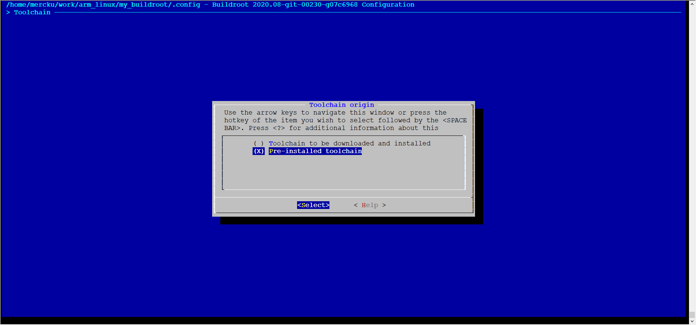
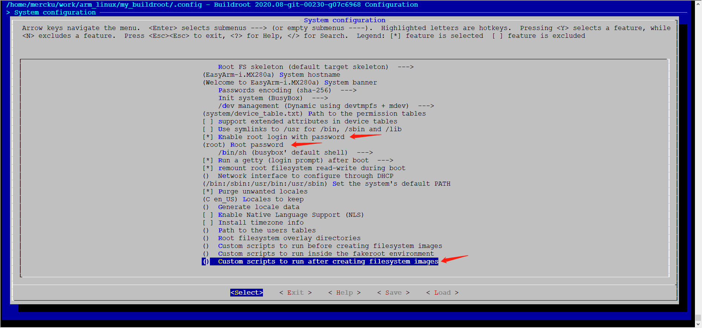
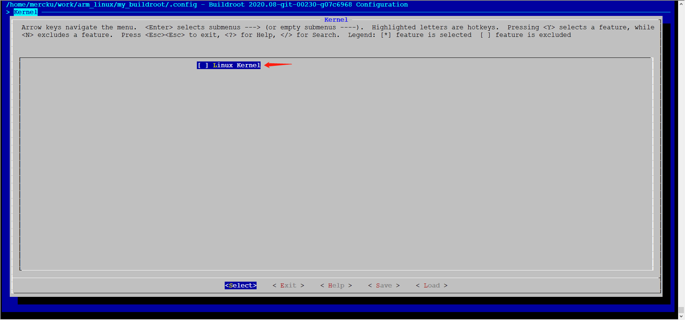
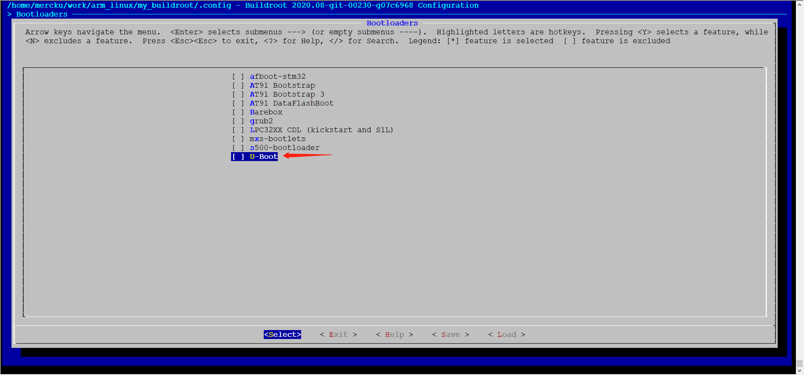
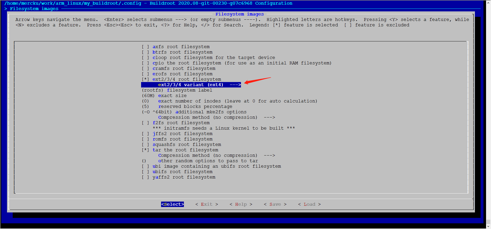

# make defconfig

```bash
$ freescale_imx28evk_defconfig
```


# make menuconfig

```bash
$ make menuconfig
```

## Toolchain





## System configuration



## Kernel



## Bootloaders



## Filesystem images




# patch defconfig

```diff
--- .config	2020-07-07 13:46:38.556073024 +0800
+++ patch-imx280a/freescale_imx28evk_defconfig	2020-07-07 13:34:56.015693214 +0800
@@ -1,6 +1,6 @@
 #
 # Automatically generated file; DO NOT EDIT.
-# Buildroot 2020.08-git-00232-gf09ac10-dirty Configuration
+# Buildroot 2020.08-git-00230-g07c6968 Configuration
 #
 BR2_HAVE_DOT_CONFIG=y
 BR2_HOST_GCC_AT_LEAST_4_9=y
@@ -199,141 +199,120 @@
 # Security Hardening Options
 #
 # BR2_PIC_PIE is not set
-
-#
-# Stack Smashing Protection needs a toolchain w/ SSP
-#
+BR2_SSP_NONE=y
+# BR2_SSP_REGULAR is not set
+# BR2_SSP_STRONG is not set
+# BR2_SSP_ALL is not set
 BR2_RELRO_NONE=y
 # BR2_RELRO_PARTIAL is not set
 # BR2_RELRO_FULL is not set
-
-#
-# Fortify Source needs a glibc toolchain and optimization
-#
+BR2_FORTIFY_SOURCE_NONE=y
+# BR2_FORTIFY_SOURCE_1 is not set
+# BR2_FORTIFY_SOURCE_2 is not set
 
 #
 # Toolchain
 #
 BR2_TOOLCHAIN=y
-BR2_TOOLCHAIN_USES_UCLIBC=y
-BR2_TOOLCHAIN_BUILDROOT=y
-# BR2_TOOLCHAIN_EXTERNAL is not set
-
-#
-# Toolchain Buildroot Options
-#
-BR2_TOOLCHAIN_BUILDROOT_VENDOR="buildroot"
-BR2_TOOLCHAIN_BUILDROOT_UCLIBC=y
-# BR2_TOOLCHAIN_BUILDROOT_GLIBC is not set
-# BR2_TOOLCHAIN_BUILDROOT_MUSL is not set
-BR2_TOOLCHAIN_BUILDROOT_LIBC="uclibc"
-
-#
-# Kernel Header Options
-#
-BR2_KERNEL_HEADERS_AS_KERNEL=y
-# BR2_KERNEL_HEADERS_4_4 is not set
-# BR2_KERNEL_HEADERS_4_9 is not set
-# BR2_KERNEL_HEADERS_4_14 is not set
-# BR2_KERNEL_HEADERS_4_19 is not set
-# BR2_KERNEL_HEADERS_5_4 is not set
-# BR2_KERNEL_HEADERS_5_5 is not set
-# BR2_KERNEL_HEADERS_5_6 is not set
-# BR2_KERNEL_HEADERS_5_7 is not set
-# BR2_KERNEL_HEADERS_VERSION is not set
-# BR2_KERNEL_HEADERS_CUSTOM_TARBALL is not set
-# BR2_KERNEL_HEADERS_CUSTOM_GIT is not set
-# BR2_PACKAGE_HOST_LINUX_HEADERS_CUSTOM_5_7 is not set
-# BR2_PACKAGE_HOST_LINUX_HEADERS_CUSTOM_5_6 is not set
-# BR2_PACKAGE_HOST_LINUX_HEADERS_CUSTOM_5_5 is not set
-BR2_PACKAGE_HOST_LINUX_HEADERS_CUSTOM_5_4=y
-# BR2_PACKAGE_HOST_LINUX_HEADERS_CUSTOM_5_3 is not set
-# BR2_PACKAGE_HOST_LINUX_HEADERS_CUSTOM_5_2 is not set
-# BR2_PACKAGE_HOST_LINUX_HEADERS_CUSTOM_5_1 is not set
-# BR2_PACKAGE_HOST_LINUX_HEADERS_CUSTOM_5_0 is not set
-# BR2_PACKAGE_HOST_LINUX_HEADERS_CUSTOM_4_20 is not set
-# BR2_PACKAGE_HOST_LINUX_HEADERS_CUSTOM_4_19 is not set
-# BR2_PACKAGE_HOST_LINUX_HEADERS_CUSTOM_4_18 is not set
-# BR2_PACKAGE_HOST_LINUX_HEADERS_CUSTOM_4_17 is not set
-# BR2_PACKAGE_HOST_LINUX_HEADERS_CUSTOM_4_16 is not set
-# BR2_PACKAGE_HOST_LINUX_HEADERS_CUSTOM_4_15 is not set
-# BR2_PACKAGE_HOST_LINUX_HEADERS_CUSTOM_4_14 is not set
-# BR2_PACKAGE_HOST_LINUX_HEADERS_CUSTOM_4_13 is not set
-# BR2_PACKAGE_HOST_LINUX_HEADERS_CUSTOM_4_12 is not set
-# BR2_PACKAGE_HOST_LINUX_HEADERS_CUSTOM_4_11 is not set
-# BR2_PACKAGE_HOST_LINUX_HEADERS_CUSTOM_4_10 is not set
-# BR2_PACKAGE_HOST_LINUX_HEADERS_CUSTOM_4_9 is not set
-# BR2_PACKAGE_HOST_LINUX_HEADERS_CUSTOM_4_8 is not set
-# BR2_PACKAGE_HOST_LINUX_HEADERS_CUSTOM_4_7 is not set
-# BR2_PACKAGE_HOST_LINUX_HEADERS_CUSTOM_4_6 is not set
-# BR2_PACKAGE_HOST_LINUX_HEADERS_CUSTOM_4_5 is not set
-# BR2_PACKAGE_HOST_LINUX_HEADERS_CUSTOM_4_4 is not set
-# BR2_PACKAGE_HOST_LINUX_HEADERS_CUSTOM_4_3 is not set
-# BR2_PACKAGE_HOST_LINUX_HEADERS_CUSTOM_4_2 is not set
-# BR2_PACKAGE_HOST_LINUX_HEADERS_CUSTOM_4_1 is not set
-# BR2_PACKAGE_HOST_LINUX_HEADERS_CUSTOM_4_0 is not set
-# BR2_PACKAGE_HOST_LINUX_HEADERS_CUSTOM_3_19 is not set
-# BR2_PACKAGE_HOST_LINUX_HEADERS_CUSTOM_3_18 is not set
-# BR2_PACKAGE_HOST_LINUX_HEADERS_CUSTOM_3_17 is not set
-# BR2_PACKAGE_HOST_LINUX_HEADERS_CUSTOM_3_16 is not set
-# BR2_PACKAGE_HOST_LINUX_HEADERS_CUSTOM_3_15 is not set
-# BR2_PACKAGE_HOST_LINUX_HEADERS_CUSTOM_3_14 is not set
-# BR2_PACKAGE_HOST_LINUX_HEADERS_CUSTOM_3_13 is not set
-# BR2_PACKAGE_HOST_LINUX_HEADERS_CUSTOM_3_12 is not set
-# BR2_PACKAGE_HOST_LINUX_HEADERS_CUSTOM_3_11 is not set
-# BR2_PACKAGE_HOST_LINUX_HEADERS_CUSTOM_3_10 is not set
-# BR2_PACKAGE_HOST_LINUX_HEADERS_CUSTOM_3_9 is not set
-# BR2_PACKAGE_HOST_LINUX_HEADERS_CUSTOM_3_8 is not set
-# BR2_PACKAGE_HOST_LINUX_HEADERS_CUSTOM_3_7 is not set
-# BR2_PACKAGE_HOST_LINUX_HEADERS_CUSTOM_3_6 is not set
-# BR2_PACKAGE_HOST_LINUX_HEADERS_CUSTOM_3_5 is not set
-# BR2_PACKAGE_HOST_LINUX_HEADERS_CUSTOM_3_4 is not set
-# BR2_PACKAGE_HOST_LINUX_HEADERS_CUSTOM_3_3 is not set
-# BR2_PACKAGE_HOST_LINUX_HEADERS_CUSTOM_3_2 is not set
-# BR2_PACKAGE_HOST_LINUX_HEADERS_CUSTOM_3_1 is not set
-# BR2_PACKAGE_HOST_LINUX_HEADERS_CUSTOM_3_0 is not set
-# BR2_PACKAGE_HOST_LINUX_HEADERS_CUSTOM_REALLY_OLD is not set
-BR2_PACKAGE_LINUX_HEADERS=y
-
-#
-# uClibc Options
-#
-BR2_PACKAGE_UCLIBC=y
-BR2_UCLIBC_CONFIG="package/uclibc/uClibc-ng.config"
-BR2_UCLIBC_CONFIG_FRAGMENT_FILES=""
-# BR2_TOOLCHAIN_BUILDROOT_WCHAR is not set
-# BR2_TOOLCHAIN_BUILDROOT_LOCALE is not set
-BR2_PTHREADS_NATIVE=y
-# BR2_PTHREADS is not set
-# BR2_PTHREADS_NONE is not set
-# BR2_PTHREAD_DEBUG is not set
-# BR2_TOOLCHAIN_BUILDROOT_USE_SSP is not set
-BR2_UCLIBC_INSTALL_UTILS=y
-BR2_UCLIBC_TARGET_ARCH="arm"
-
-#
-# Binutils Options
-#
-BR2_PACKAGE_HOST_BINUTILS_SUPPORTS_CFI=y
-# BR2_BINUTILS_VERSION_2_31_X is not set
-BR2_BINUTILS_VERSION_2_32_X=y
-# BR2_BINUTILS_VERSION_2_33_X is not set
-BR2_BINUTILS_VERSION="2.32"
-BR2_BINUTILS_EXTRA_CONFIG_OPTIONS=""
-
-#
-# GCC Options
-#
-# BR2_GCC_VERSION_7_X is not set
-BR2_GCC_VERSION_8_X=y
-# BR2_GCC_VERSION_9_X is not set
-BR2_GCC_VERSION="8.4.0"
-BR2_EXTRA_GCC_CONFIG_OPTIONS=""
-# BR2_TOOLCHAIN_BUILDROOT_CXX is not set
-# BR2_TOOLCHAIN_BUILDROOT_FORTRAN is not set
-# BR2_GCC_ENABLE_LTO is not set
-# BR2_GCC_ENABLE_OPENMP is not set
-# BR2_GCC_ENABLE_GRAPHITE is not set
+BR2_TOOLCHAIN_USES_GLIBC=y
+# BR2_TOOLCHAIN_BUILDROOT is not set
+BR2_TOOLCHAIN_EXTERNAL=y
+
+#
+# Toolchain External Options
+#
+
+#
+# Arm toolchains available for Cortex-A + EABIhf
+#
+
+#
+# Linaro toolchains available for Cortex-A + EABIhf
+#
+# BR2_TOOLCHAIN_EXTERNAL_CODESOURCERY_ARM is not set
+BR2_TOOLCHAIN_EXTERNAL_CUSTOM=y
+# BR2_TOOLCHAIN_EXTERNAL_DOWNLOAD is not set
+BR2_TOOLCHAIN_EXTERNAL_PREINSTALLED=y
+BR2_TOOLCHAIN_EXTERNAL_PATH="${HOME}/work/toolchain/arm-926ejs-linux-gnueabi"
+BR2_TOOLCHAIN_EXTERNAL_GLIBC=y
+BR2_PACKAGE_HAS_TOOLCHAIN_EXTERNAL=y
+BR2_PACKAGE_PROVIDES_TOOLCHAIN_EXTERNAL="toolchain-external-custom"
+BR2_TOOLCHAIN_EXTERNAL_PREFIX="arm-926ejs-linux-gnueabi"
+BR2_TOOLCHAIN_EXTERNAL_CUSTOM_PREFIX="arm-926ejs-linux-gnueabi"
+BR2_TOOLCHAIN_EXTERNAL_GCC_9=y
+# BR2_TOOLCHAIN_EXTERNAL_GCC_8 is not set
+# BR2_TOOLCHAIN_EXTERNAL_GCC_7 is not set
+# BR2_TOOLCHAIN_EXTERNAL_GCC_6 is not set
+# BR2_TOOLCHAIN_EXTERNAL_GCC_5 is not set
+# BR2_TOOLCHAIN_EXTERNAL_GCC_4_9 is not set
+# BR2_TOOLCHAIN_EXTERNAL_GCC_4_8 is not set
+# BR2_TOOLCHAIN_EXTERNAL_GCC_4_7 is not set
+# BR2_TOOLCHAIN_EXTERNAL_GCC_4_6 is not set
+# BR2_TOOLCHAIN_EXTERNAL_GCC_4_5 is not set
+# BR2_TOOLCHAIN_EXTERNAL_GCC_4_4 is not set
+# BR2_TOOLCHAIN_EXTERNAL_GCC_4_3 is not set
+# BR2_TOOLCHAIN_EXTERNAL_GCC_OLD is not set
+# BR2_TOOLCHAIN_EXTERNAL_HEADERS_5_7 is not set
+# BR2_TOOLCHAIN_EXTERNAL_HEADERS_5_6 is not set
+BR2_TOOLCHAIN_EXTERNAL_HEADERS_5_5=y
+# BR2_TOOLCHAIN_EXTERNAL_HEADERS_5_4 is not set
+# BR2_TOOLCHAIN_EXTERNAL_HEADERS_5_3 is not set
+# BR2_TOOLCHAIN_EXTERNAL_HEADERS_5_2 is not set
+# BR2_TOOLCHAIN_EXTERNAL_HEADERS_5_1 is not set
+# BR2_TOOLCHAIN_EXTERNAL_HEADERS_5_0 is not set
+# BR2_TOOLCHAIN_EXTERNAL_HEADERS_4_20 is not set
+# BR2_TOOLCHAIN_EXTERNAL_HEADERS_4_19 is not set
+# BR2_TOOLCHAIN_EXTERNAL_HEADERS_4_18 is not set
+# BR2_TOOLCHAIN_EXTERNAL_HEADERS_4_17 is not set
+# BR2_TOOLCHAIN_EXTERNAL_HEADERS_4_16 is not set
+# BR2_TOOLCHAIN_EXTERNAL_HEADERS_4_15 is not set
+# BR2_TOOLCHAIN_EXTERNAL_HEADERS_4_14 is not set
+# BR2_TOOLCHAIN_EXTERNAL_HEADERS_4_13 is not set
+# BR2_TOOLCHAIN_EXTERNAL_HEADERS_4_12 is not set
+# BR2_TOOLCHAIN_EXTERNAL_HEADERS_4_11 is not set
+# BR2_TOOLCHAIN_EXTERNAL_HEADERS_4_10 is not set
+# BR2_TOOLCHAIN_EXTERNAL_HEADERS_4_9 is not set
+# BR2_TOOLCHAIN_EXTERNAL_HEADERS_4_8 is not set
+# BR2_TOOLCHAIN_EXTERNAL_HEADERS_4_7 is not set
+# BR2_TOOLCHAIN_EXTERNAL_HEADERS_4_6 is not set
+# BR2_TOOLCHAIN_EXTERNAL_HEADERS_4_5 is not set
+# BR2_TOOLCHAIN_EXTERNAL_HEADERS_4_4 is not set
+# BR2_TOOLCHAIN_EXTERNAL_HEADERS_4_3 is not set
+# BR2_TOOLCHAIN_EXTERNAL_HEADERS_4_2 is not set
+# BR2_TOOLCHAIN_EXTERNAL_HEADERS_4_1 is not set
+# BR2_TOOLCHAIN_EXTERNAL_HEADERS_4_0 is not set
+# BR2_TOOLCHAIN_EXTERNAL_HEADERS_3_19 is not set
+# BR2_TOOLCHAIN_EXTERNAL_HEADERS_3_18 is not set
+# BR2_TOOLCHAIN_EXTERNAL_HEADERS_3_17 is not set
+# BR2_TOOLCHAIN_EXTERNAL_HEADERS_3_16 is not set
+# BR2_TOOLCHAIN_EXTERNAL_HEADERS_3_15 is not set
+# BR2_TOOLCHAIN_EXTERNAL_HEADERS_3_14 is not set
+# BR2_TOOLCHAIN_EXTERNAL_HEADERS_3_13 is not set
+# BR2_TOOLCHAIN_EXTERNAL_HEADERS_3_12 is not set
+# BR2_TOOLCHAIN_EXTERNAL_HEADERS_3_11 is not set
+# BR2_TOOLCHAIN_EXTERNAL_HEADERS_3_10 is not set
+# BR2_TOOLCHAIN_EXTERNAL_HEADERS_3_9 is not set
+# BR2_TOOLCHAIN_EXTERNAL_HEADERS_3_8 is not set
+# BR2_TOOLCHAIN_EXTERNAL_HEADERS_3_7 is not set
+# BR2_TOOLCHAIN_EXTERNAL_HEADERS_3_6 is not set
+# BR2_TOOLCHAIN_EXTERNAL_HEADERS_3_5 is not set
+# BR2_TOOLCHAIN_EXTERNAL_HEADERS_3_4 is not set
+# BR2_TOOLCHAIN_EXTERNAL_HEADERS_3_3 is not set
+# BR2_TOOLCHAIN_EXTERNAL_HEADERS_3_2 is not set
+# BR2_TOOLCHAIN_EXTERNAL_HEADERS_3_1 is not set
+# BR2_TOOLCHAIN_EXTERNAL_HEADERS_3_0 is not set
+# BR2_TOOLCHAIN_EXTERNAL_HEADERS_REALLY_OLD is not set
+# BR2_TOOLCHAIN_EXTERNAL_CUSTOM_UCLIBC is not set
+BR2_TOOLCHAIN_EXTERNAL_CUSTOM_GLIBC=y
+# BR2_TOOLCHAIN_EXTERNAL_CUSTOM_MUSL is not set
+BR2_TOOLCHAIN_EXTERNAL_HAS_SSP=y
+BR2_TOOLCHAIN_EXTERNAL_HAS_SSP_STRONG=y
+BR2_TOOLCHAIN_EXTERNAL_INET_RPC=y
+# BR2_TOOLCHAIN_EXTERNAL_CXX is not set
+# BR2_TOOLCHAIN_EXTERNAL_DLANG is not set
+# BR2_TOOLCHAIN_EXTERNAL_FORTRAN is not set
+# BR2_TOOLCHAIN_EXTERNAL_OPENMP is not set
+# BR2_TOOLCHAIN_EXTERNAL_GDB_SERVER_COPY is not set
 BR2_PACKAGE_HOST_GDB_ARCH_SUPPORTS=y
 
 #
@@ -345,11 +324,19 @@
 # Toolchain Generic Options
 #
 BR2_TOOLCHAIN_SUPPORTS_VARIADIC_MI_THUNK=y
+BR2_TOOLCHAIN_HAS_NATIVE_RPC=y
+BR2_USE_WCHAR=y
+BR2_ENABLE_LOCALE=y
 BR2_TOOLCHAIN_HAS_THREADS=y
+BR2_TOOLCHAIN_HAS_THREADS_DEBUG=y
 BR2_TOOLCHAIN_HAS_THREADS_NPTL=y
+BR2_TOOLCHAIN_HAS_SSP=y
+BR2_TOOLCHAIN_HAS_SSP_STRONG=y
 BR2_TOOLCHAIN_HAS_UCONTEXT=y
 BR2_TOOLCHAIN_SUPPORTS_PIE=y
+# BR2_TOOLCHAIN_GLIBC_GCONV_LIBS_COPY is not set
 BR2_TOOLCHAIN_EXTRA_LIBS=""
+BR2_TOOLCHAIN_HAS_FULL_GETTEXT=y
 BR2_USE_MMU=y
 BR2_TARGET_OPTIMIZATION=""
 BR2_TARGET_LDFLAGS=""
@@ -400,7 +387,8 @@
 BR2_TOOLCHAIN_HEADERS_AT_LEAST_5_2=y
 BR2_TOOLCHAIN_HEADERS_AT_LEAST_5_3=y
 BR2_TOOLCHAIN_HEADERS_AT_LEAST_5_4=y
-BR2_TOOLCHAIN_HEADERS_AT_LEAST="5.4"
+BR2_TOOLCHAIN_HEADERS_AT_LEAST_5_5=y
+BR2_TOOLCHAIN_HEADERS_AT_LEAST="5.5"
 BR2_TOOLCHAIN_GCC_AT_LEAST_4_3=y
 BR2_TOOLCHAIN_GCC_AT_LEAST_4_4=y
 BR2_TOOLCHAIN_GCC_AT_LEAST_4_5=y
@@ -412,11 +400,14 @@
 BR2_TOOLCHAIN_GCC_AT_LEAST_6=y
 BR2_TOOLCHAIN_GCC_AT_LEAST_7=y
 BR2_TOOLCHAIN_GCC_AT_LEAST_8=y
-BR2_TOOLCHAIN_GCC_AT_LEAST="8"
+BR2_TOOLCHAIN_GCC_AT_LEAST_9=y
+BR2_TOOLCHAIN_GCC_AT_LEAST="9"
 BR2_TOOLCHAIN_HAS_MNAN_OPTION=y
 BR2_TOOLCHAIN_HAS_SYNC_1=y
 BR2_TOOLCHAIN_HAS_SYNC_2=y
 BR2_TOOLCHAIN_HAS_SYNC_4=y
+BR2_TOOLCHAIN_ARM_HAS_SYNC_8=y
+BR2_TOOLCHAIN_HAS_SYNC_8=y
 BR2_TOOLCHAIN_HAS_LIBATOMIC=y
 BR2_TOOLCHAIN_HAS_ATOMIC=y
 
@@ -425,31 +416,25 @@
 #
 BR2_ROOTFS_SKELETON_DEFAULT=y
 # BR2_ROOTFS_SKELETON_CUSTOM is not set
-BR2_TARGET_GENERIC_HOSTNAME="buildroot"
-BR2_TARGET_GENERIC_ISSUE="Welcome to Buildroot"
+BR2_TARGET_GENERIC_HOSTNAME="EasyArm-i.MX280a"
+BR2_TARGET_GENERIC_ISSUE="Welcome to EasyArm-i.MX280a"
 BR2_TARGET_GENERIC_PASSWD_SHA256=y
 # BR2_TARGET_GENERIC_PASSWD_SHA512 is not set
 BR2_TARGET_GENERIC_PASSWD_METHOD="sha-256"
 BR2_INIT_BUSYBOX=y
 # BR2_INIT_SYSV is not set
 # BR2_INIT_OPENRC is not set
-
-#
-# systemd needs a glibc toolchain w/ SSP, headers >= 3.10, host and target gcc >= 5
-#
+# BR2_INIT_SYSTEMD is not set
 # BR2_INIT_NONE is not set
 # BR2_ROOTFS_DEVICE_CREATION_STATIC is not set
-BR2_ROOTFS_DEVICE_CREATION_DYNAMIC_DEVTMPFS=y
-# BR2_ROOTFS_DEVICE_CREATION_DYNAMIC_MDEV is not set
-
-#
-# eudev needs a toolchain w/ wchar, dynamic library
-#
+# BR2_ROOTFS_DEVICE_CREATION_DYNAMIC_DEVTMPFS is not set
+BR2_ROOTFS_DEVICE_CREATION_DYNAMIC_MDEV=y
+# BR2_ROOTFS_DEVICE_CREATION_DYNAMIC_EUDEV is not set
 BR2_ROOTFS_DEVICE_TABLE="system/device_table.txt"
 # BR2_ROOTFS_DEVICE_TABLE_SUPPORTS_EXTENDED_ATTRIBUTES is not set
 # BR2_ROOTFS_MERGED_USR is not set
 BR2_TARGET_ENABLE_ROOT_LOGIN=y
-BR2_TARGET_GENERIC_ROOT_PASSWD=""
+BR2_TARGET_GENERIC_ROOT_PASSWD="root"
 BR2_SYSTEM_BIN_SH_BUSYBOX=y
 
 #
@@ -472,82 +457,19 @@
 BR2_SYSTEM_DEFAULT_PATH="/bin:/sbin:/usr/bin:/usr/sbin"
 BR2_ENABLE_LOCALE_PURGE=y
 BR2_ENABLE_LOCALE_WHITELIST="C en_US"
-
-#
-# NLS support needs a toolchain w/ wchar, dynamic library
-#
+BR2_GENERATE_LOCALE=""
+# BR2_SYSTEM_ENABLE_NLS is not set
 # BR2_TARGET_TZ_INFO is not set
 BR2_ROOTFS_USERS_TABLES=""
 BR2_ROOTFS_OVERLAY=""
 BR2_ROOTFS_POST_BUILD_SCRIPT=""
 BR2_ROOTFS_POST_FAKEROOT_SCRIPT=""
-BR2_ROOTFS_POST_IMAGE_SCRIPT="board/freescale/common/mxs/post-image.sh"
-BR2_ROOTFS_POST_SCRIPT_ARGS=""
+BR2_ROOTFS_POST_IMAGE_SCRIPT=""
 
 #
 # Kernel
 #
-BR2_LINUX_KERNEL=y
-# BR2_LINUX_KERNEL_LATEST_VERSION is not set
-# BR2_LINUX_KERNEL_LATEST_CIP_VERSION is not set
-# BR2_LINUX_KERNEL_LATEST_CIP_RT_VERSION is not set
-BR2_LINUX_KERNEL_CUSTOM_VERSION=y
-# BR2_LINUX_KERNEL_CUSTOM_TARBALL is not set
-# BR2_LINUX_KERNEL_CUSTOM_GIT is not set
-# BR2_LINUX_KERNEL_CUSTOM_HG is not set
-# BR2_LINUX_KERNEL_CUSTOM_SVN is not set
-BR2_LINUX_KERNEL_CUSTOM_VERSION_VALUE="5.4.42"
-BR2_LINUX_KERNEL_VERSION="5.4.42"
-BR2_LINUX_KERNEL_PATCH=""
-BR2_LINUX_KERNEL_USE_DEFCONFIG=y
-# BR2_LINUX_KERNEL_USE_ARCH_DEFAULT_CONFIG is not set
-# BR2_LINUX_KERNEL_USE_CUSTOM_CONFIG is not set
-BR2_LINUX_KERNEL_DEFCONFIG="mxs"
-BR2_LINUX_KERNEL_CONFIG_FRAGMENT_FILES=""
-BR2_LINUX_KERNEL_CUSTOM_LOGO_PATH=""
-# BR2_LINUX_KERNEL_UIMAGE is not set
-# BR2_LINUX_KERNEL_APPENDED_UIMAGE is not set
-BR2_LINUX_KERNEL_ZIMAGE=y
-# BR2_LINUX_KERNEL_APPENDED_ZIMAGE is not set
-# BR2_LINUX_KERNEL_VMLINUX is not set
-# BR2_LINUX_KERNEL_IMAGE_TARGET_CUSTOM is not set
-BR2_LINUX_KERNEL_GZIP=y
-# BR2_LINUX_KERNEL_LZ4 is not set
-# BR2_LINUX_KERNEL_LZMA is not set
-# BR2_LINUX_KERNEL_LZO is not set
-# BR2_LINUX_KERNEL_XZ is not set
-BR2_LINUX_KERNEL_DTS_SUPPORT=y
-# BR2_LINUX_KERNEL_DTB_IS_SELF_BUILT is not set
-BR2_LINUX_KERNEL_INTREE_DTS_NAME="imx28-evk"
-BR2_LINUX_KERNEL_CUSTOM_DTS_PATH=""
-# BR2_LINUX_KERNEL_DTB_KEEP_DIRNAME is not set
-# BR2_LINUX_KERNEL_DTB_OVERLAY_SUPPORT is not set
-# BR2_LINUX_KERNEL_INSTALL_TARGET is not set
-# BR2_LINUX_KERNEL_NEEDS_HOST_OPENSSL is not set
-# BR2_LINUX_KERNEL_NEEDS_HOST_LIBELF is not set
-
-#
-# Linux Kernel Extensions
-#
-# BR2_LINUX_KERNEL_EXT_XENOMAI is not set
-# BR2_LINUX_KERNEL_EXT_RTAI is not set
-# BR2_LINUX_KERNEL_EXT_EV3DEV_LINUX_DRIVERS is not set
-# BR2_LINUX_KERNEL_EXT_FBTFT is not set
-# BR2_LINUX_KERNEL_EXT_AUFS is not set
-
-#
-# Linux Kernel Tools
-#
-# BR2_PACKAGE_LINUX_TOOLS_CPUPOWER is not set
-# BR2_PACKAGE_LINUX_TOOLS_GPIO is not set
-# BR2_PACKAGE_LINUX_TOOLS_IIO is not set
-# BR2_PACKAGE_LINUX_TOOLS_PCI is not set
-# BR2_PACKAGE_LINUX_TOOLS_PERF is not set
-
-#
-# selftests needs BR2_PACKAGE_BUSYBOX_SHOW_OTHERS and a toolchain w/ dynamic library
-#
-# BR2_PACKAGE_LINUX_TOOLS_TMON is not set
+# BR2_LINUX_KERNEL is not set
 
 #
 # Target packages
@@ -574,10 +496,7 @@
 #
 # bellagio needs a toolchain w/ C++, threads, dynamic library
 #
-
-#
-# bluez-alsa needs a toolchain w/ wchar, NPTL, headers >= 3.4, dynamic library
-#
+# BR2_PACKAGE_BLUEZ_ALSA is not set
 # BR2_PACKAGE_DVBLAST is not set
 # BR2_PACKAGE_DVDAUTHOR is not set
 
@@ -591,27 +510,12 @@
 # BR2_PACKAGE_FAAD2 is not set
 BR2_PACKAGE_FFMPEG_ARCH_SUPPORTS=y
 # BR2_PACKAGE_FFMPEG is not set
-
-#
-# flac needs a toolchain w/ wchar
-#
-
-#
-# flite needs a toolchain w/ wchar
-#
+# BR2_PACKAGE_FLAC is not set
+# BR2_PACKAGE_FLITE is not set
 # BR2_PACKAGE_FLUID_SOUNDFONT is not set
-
-#
-# fluidsynth needs a toolchain w/ threads, wchar
-#
-
-#
-# gmrender-resurrect needs a toolchain w/ wchar, threads
-#
-
-#
-# gstreamer 1.x needs a toolchain w/ wchar, threads
-#
+# BR2_PACKAGE_FLUIDSYNTH is not set
+# BR2_PACKAGE_GMRENDER_RESURRECT is not set
+# BR2_PACKAGE_GSTREAMER1 is not set
 # BR2_PACKAGE_JACK1 is not set
 
 #
@@ -628,10 +532,7 @@
 #
 # BR2_PACKAGE_LAME is not set
 # BR2_PACKAGE_MADPLAY is not set
-
-#
-# mimic needs a toolchain w/ wchar
-#
+# BR2_PACKAGE_MIMIC is not set
 # BR2_PACKAGE_MINIMODEM is not set
 
 #
@@ -669,15 +570,9 @@
 #
 # BR2_PACKAGE_OPUS_TOOLS is not set
 BR2_PACKAGE_PULSEAUDIO_HAS_ATOMIC=y
-
-#
-# pulseaudio needs a toolchain w/ wchar, threads, dynamic library
-#
+# BR2_PACKAGE_PULSEAUDIO is not set
 # BR2_PACKAGE_SOX is not set
-
-#
-# squeezelite needs a toolchain w/ wchar, NPTL, dynamic library
-#
+# BR2_PACKAGE_SQUEEZELITE is not set
 
 #
 # tovid needs a toolchain w/ threads, C++, wchar, gcc >= 4.5
@@ -693,7 +588,10 @@
 #
 # v4l2grab needs a toolchain w/ threads, dynamic library, C++ and headers >= 3.0
 #
-# BR2_PACKAGE_V4L2LOOPBACK is not set
+
+#
+# v4l2loopback needs a Linux kernel to be built
+#
 
 #
 # vlc needs a toolchain w/ C++, dynamic library, wchar, threads, gcc >= 4.9, headers >= 3.7
@@ -723,10 +621,7 @@
 # p7zip needs a toolchain w/ threads, wchar, C++
 #
 # BR2_PACKAGE_PIGZ is not set
-
-#
-# pixz needs a toolchain w/ threads, wchar
-#
+# BR2_PACKAGE_PIXZ is not set
 
 #
 # unrar needs a toolchain w/ C++, wchar, threads
@@ -756,10 +651,7 @@
 # BR2_PACKAGE_DIEHARDER is not set
 # BR2_PACKAGE_DMALLOC is not set
 # BR2_PACKAGE_DROPWATCH is not set
-
-#
-# dstat needs a toolchain w/ wchar, threads, dynamic library
-#
+# BR2_PACKAGE_DSTAT is not set
 # BR2_PACKAGE_DT is not set
 
 #
@@ -769,10 +661,6 @@
 BR2_PACKAGE_GDB_ARCH_SUPPORTS=y
 
 #
-# gdb/gdbserver needs a toolchain w/ threads, threads debug
-#
-
-#
 # gdb/gdbserver >= 8.x needs a toolchain w/ C++, gcc >= 4.8
 #
 BR2_PACKAGE_GOOGLE_BREAKPAD_ARCH_SUPPORTS=y
@@ -782,42 +670,32 @@
 #
 # BR2_PACKAGE_IOZONE is not set
 # BR2_PACKAGE_KEXEC is not set
-# BR2_PACKAGE_KTAP is not set
 
 #
-# latencytop needs a toolchain w/ wchar, threads
+# ktap needs a Linux kernel to be built
 #
+# BR2_PACKAGE_LATENCYTOP is not set
 # BR2_PACKAGE_LMBENCH is not set
 BR2_PACKAGE_LTP_TESTSUITE_ARCH_SUPPORTS=y
 # BR2_PACKAGE_LTP_TESTSUITE is not set
 BR2_PACKAGE_LTRACE_ARCH_SUPPORTS=y
+# BR2_PACKAGE_LTRACE is not set
+# BR2_PACKAGE_LTTNG_BABELTRACE is not set
 
 #
-# ltrace needs a uClibc or glibc toolchain w/ wchar, dynamic library
-#
-
-#
-# lttng-babeltrace needs a toolchain w/ wchar, threads
+# lttng-modules needs a Linux kernel to be built
 #
-# BR2_PACKAGE_LTTNG_MODULES is not set
 # BR2_PACKAGE_LTTNG_TOOLS is not set
 # BR2_PACKAGE_MEMSTAT is not set
 # BR2_PACKAGE_NETPERF is not set
 # BR2_PACKAGE_NETSNIFF_NG is not set
-
-#
-# nmon needs a glibc toolchain
-#
+# BR2_PACKAGE_NMON is not set
 BR2_PACKAGE_OPROFILE_ARCH_SUPPORTS=y
 
 #
 # oprofile needs a toolchain w/ C++, wchar
 #
 # BR2_PACKAGE_PAX_UTILS is not set
-
-#
-# piglit needs glibc or musl
-#
 BR2_PACKAGE_PTM2HUMAN_ARCH_SUPPORTS=y
 # BR2_PACKAGE_PTM2HUMAN is not set
 # BR2_PACKAGE_PV is not set
@@ -845,10 +723,7 @@
 #
 # Development tools
 #
-
-#
-# binutils needs a toolchain w/ wchar
-#
+# BR2_PACKAGE_BINUTILS is not set
 # BR2_PACKAGE_BSDIFF is not set
 # BR2_PACKAGE_CHECK is not set
 BR2_PACKAGE_CMAKE_ARCH_SUPPORTS=y
@@ -861,10 +736,7 @@
 # cppunit needs a toolchain w/ C++, dynamic library
 #
 # BR2_PACKAGE_CUNIT is not set
-
-#
-# cvs needs a toolchain w/ wchar
-#
+# BR2_PACKAGE_CVS is not set
 
 #
 # cxxtest needs a toolchain w/ C++ support
@@ -887,92 +759,50 @@
 # BR2_PACKAGE_MAKE is not set
 # BR2_PACKAGE_PKGCONF is not set
 # BR2_PACKAGE_SUBVERSION is not set
+# BR2_PACKAGE_TREE is not set
 
 #
-# tree needs a toolchain w/ wchar
+# Filesystem and flash utilities
 #
+# BR2_PACKAGE_ABOOTIMG is not set
 
 #
-# Filesystem and flash utilities
+# aufs-util needs a linux kernel and a toolchain w/ threads
 #
-# BR2_PACKAGE_ABOOTIMG is not set
-# BR2_PACKAGE_AUFS_UTIL is not set
 # BR2_PACKAGE_AUTOFS is not set
 # BR2_PACKAGE_BTRFS_PROGS is not set
 # BR2_PACKAGE_CIFS_UTILS is not set
-
-#
-# cpio needs a toolchain w/ wchar
-#
+# BR2_PACKAGE_CPIO is not set
 # BR2_PACKAGE_CRAMFS is not set
-
-#
-# curlftpfs needs a toolchain w/ wchar, threads, dynamic library
-#
+# BR2_PACKAGE_CURLFTPFS is not set
 # BR2_PACKAGE_DAVFS2 is not set
-
-#
-# dosfstools needs a toolchain w/ wchar
-#
+# BR2_PACKAGE_DOSFSTOOLS is not set
 # BR2_PACKAGE_E2FSPROGS is not set
-
-#
-# e2tools needs a toolchain w/ threads, wchar
-#
-
-#
-# ecryptfs-utils needs a toolchain w/ threads, wchar, dynamic library
-#
+# BR2_PACKAGE_E2TOOLS is not set
+# BR2_PACKAGE_ECRYPTFS_UTILS is not set
 # BR2_PACKAGE_EROFS_UTILS is not set
-
-#
-# exfat needs a toolchain w/ wchar, threads, dynamic library
-#
-
-#
-# exfat-utils needs a toolchain w/ wchar
-#
-
-#
-# exfatprogs needs a toolchain w/ wchar
-#
-
-#
-# f2fs-tools needs a toolchain w/ wchar
-#
+# BR2_PACKAGE_EXFAT is not set
+# BR2_PACKAGE_EXFAT_UTILS is not set
+# BR2_PACKAGE_EXFATPROGS is not set
+# BR2_PACKAGE_F2FS_TOOLS is not set
 # BR2_PACKAGE_FLASHBENCH is not set
 # BR2_PACKAGE_FSCRYPTCTL is not set
-
-#
-# fwup needs a toolchain w/ wchar
-#
+# BR2_PACKAGE_FWUP is not set
 # BR2_PACKAGE_GENEXT2FS is not set
 # BR2_PACKAGE_GENPART is not set
 # BR2_PACKAGE_GENROMFS is not set
 # BR2_PACKAGE_IMX_USB_LOADER is not set
 # BR2_PACKAGE_MMC_UTILS is not set
 # BR2_PACKAGE_MTD is not set
-
-#
-# mtools needs a toolchain w/ wchar
-#
+# BR2_PACKAGE_MTOOLS is not set
 # BR2_PACKAGE_NFS_UTILS is not set
 # BR2_PACKAGE_NILFS_UTILS is not set
-
-#
-# ntfs-3g needs a toolchain w/ wchar, threads, dynamic library
-#
+# BR2_PACKAGE_NTFS_3G is not set
 # BR2_PACKAGE_SP_OOPS_EXTRACT is not set
 # BR2_PACKAGE_SQUASHFS is not set
-
-#
-# sshfs needs a toolchain w/ wchar, threads, dynamic library
-#
+# BR2_PACKAGE_SSHFS is not set
 # BR2_PACKAGE_SUNXI_TOOLS is not set
-
-#
-# udftools needs a toolchain w/ wchar
-#
+# BR2_PACKAGE_UDFTOOLS is not set
 # BR2_PACKAGE_UNIONFS is not set
 # BR2_PACKAGE_XFSPROGS is not set
 
@@ -1057,10 +887,6 @@
 #
 
 #
-# cage needs a toolchain w/ threads, locale, dynamic library
-#
-
-#
 # cog needs wpewebkit and a toolchain w/ threads
 #
 # BR2_PACKAGE_FSWEBCAM is not set
@@ -1074,10 +900,7 @@
 # glslsandbox-player needs a toolchain w/ threads and an openGL ES and EGL driver
 #
 # BR2_PACKAGE_GNUPLOT is not set
-
-#
-# jhead needs a toolchain w/ wchar
-#
+# BR2_PACKAGE_JHEAD is not set
 
 #
 # libva-utils needs a toolchain w/ C++, threads, dynamic library
@@ -1085,10 +908,7 @@
 BR2_PACKAGE_NETSURF_ARCH_SUPPORTS=y
 # BR2_PACKAGE_NETSURF is not set
 # BR2_PACKAGE_PNGQUANT is not set
-
-#
-# rrdtool needs a toolchain w/ wchar, threads
-#
+# BR2_PACKAGE_RRDTOOL is not set
 
 #
 # stellarium needs Qt5 and an OpenGL provider
@@ -1126,23 +946,23 @@
 # freerdp needs a toolchain w/ wchar, dynamic library, threads, C++
 #
 # BR2_PACKAGE_IMAGEMAGICK is not set
-# BR2_PACKAGE_LINUX_FUSION is not set
 
 #
-# mesa3d needs a toolchain w/ C++, NPTL, dynamic library
+# linux-fusion needs a Linux kernel to be built
 #
 
 #
-# ocrad needs a toolchain w/ C++
+# mesa3d needs a toolchain w/ C++, NPTL, dynamic library
 #
 
 #
-# ogre needs a toolchain w/ C++, dynamic library, gcc >= 4.8, threads, wchar
+# ocrad needs a toolchain w/ C++
 #
 
 #
-# psplash needs a toolchain w/ wchar
+# ogre needs a toolchain w/ C++, dynamic library, gcc >= 4.8, threads, wchar
 #
+# BR2_PACKAGE_PSPLASH is not set
 # BR2_PACKAGE_SDL is not set
 # BR2_PACKAGE_SDL2 is not set
 
@@ -1162,10 +982,7 @@
 #
 # weston needs udev and a toolchain w/ locale, threads, dynamic library, headers >= 3.0
 #
-
-#
-# X.org needs a toolchain w/ wchar, threads, dynamic library
-#
+# BR2_PACKAGE_XORG7 is not set
 
 #
 # apitrace needs a toolchain w/ C++, wchar, dynamic library, threads, gcc >= 4.9
@@ -1176,10 +993,6 @@
 #
 
 #
-# rdesktop needs a toolchain w/ wchar, dynamic library
-#
-
-#
 # vte needs a toolchain w/ wchar, threads, C++, gcc >= 4.8
 #
 
@@ -1210,7 +1023,10 @@
 # BR2_PACKAGE_WILINK_BT_FIRMWARE is not set
 # BR2_PACKAGE_ZD1211_FIRMWARE is not set
 # BR2_PACKAGE_18XX_TI_UTILS is not set
-# BR2_PACKAGE_A10DISP is not set
+
+#
+# a10disp needs a Linux kernel to be built
+#
 # BR2_PACKAGE_ACPICA is not set
 # BR2_PACKAGE_ACPID is not set
 
@@ -1223,10 +1039,7 @@
 #
 # apcupsd needs a toolchain w/ C++, threads
 #
-
-#
-# avrdude needs a uClibc or glibc toolchain w/ threads, wchar, dynamic library
-#
+# BR2_PACKAGE_AVRDUDE is not set
 
 #
 # bcache-tools needs udev /dev management
@@ -1235,10 +1048,7 @@
 #
 # brickd needs udev /dev management, a toolchain w/ threads, wchar
 #
-
-#
-# brltty needs a toolchain w/ dynamic lib, threads, wchar
-#
+# BR2_PACKAGE_BRLTTY is not set
 # BR2_PACKAGE_CBOOTIMAGE is not set
 
 #
@@ -1246,8 +1056,15 @@
 #
 # BR2_PACKAGE_CDRKIT is not set
 # BR2_PACKAGE_CRYPTSETUP is not set
-# BR2_PACKAGE_DAHDI_LINUX is not set
-# BR2_PACKAGE_DAHDI_TOOLS is not set
+# BR2_PACKAGE_CWIID is not set
+
+#
+# dahdi-linux needs a Linux kernel to be built
+#
+
+#
+# dahdi-tools needs a toolchain w/ threads and a Linux kernel to be built
+#
 # BR2_PACKAGE_DBUS is not set
 # BR2_PACKAGE_DFU_UTIL is not set
 # BR2_PACKAGE_DMRAID is not set
@@ -1263,10 +1080,6 @@
 #
 # eudev needs eudev /dev management
 #
-
-#
-# eudev needs a toolchain w/ wchar, dynamic library
-#
 # BR2_PACKAGE_EVEMU is not set
 # BR2_PACKAGE_EVTEST is not set
 # BR2_PACKAGE_FAN_CTRL is not set
@@ -1278,7 +1091,7 @@
 # BR2_PACKAGE_FXLOAD is not set
 
 #
-# gcnano-binaries needs a glibc toolchain w/ threads, dynamic library
+# gcnano-binaries needs a Linux kernel to be built
 #
 # BR2_PACKAGE_GPM is not set
 # BR2_PACKAGE_GPSD is not set
@@ -1286,10 +1099,7 @@
 #
 # gptfdisk needs a toolchain w/ C++
 #
-
-#
-# gvfs needs a toolchain w/ wchar, threads
-#
+# BR2_PACKAGE_GVFS is not set
 # BR2_PACKAGE_HWDATA is not set
 # BR2_PACKAGE_HWLOC is not set
 # BR2_PACKAGE_INPUT_EVENT_DAEMON is not set
@@ -1300,7 +1110,10 @@
 # BR2_PACKAGE_LCDPROC is not set
 # BR2_PACKAGE_LIBUBOOTENV is not set
 # BR2_PACKAGE_LIBUIO is not set
-# BR2_PACKAGE_LINUX_BACKPORTS is not set
+
+#
+# linux-backports needs a Linux kernel to be built
+#
 # BR2_PACKAGE_LINUX_SERIAL_TEST is not set
 # BR2_PACKAGE_LINUXCONSOLETOOLS is not set
 
@@ -1324,21 +1137,15 @@
 # BR2_PACKAGE_MDEVD is not set
 # BR2_PACKAGE_MEMTESTER is not set
 # BR2_PACKAGE_MEMTOOL is not set
-
-#
-# minicom needs a toolchain w/ wchar
-#
+# BR2_PACKAGE_MINICOM is not set
 # BR2_PACKAGE_NANOCOM is not set
-
-#
-# neard needs a toolchain w/ wchar, threads, dynamic library
-#
+# BR2_PACKAGE_NEARD is not set
 # BR2_PACKAGE_NVME is not set
+# BR2_PACKAGE_OFONO is not set
 
 #
-# ofono needs a toolchain w/ dynamic library, wchar, threads, headers >= 4.12
+# on2-8170-modules needs a Linux kernel to be built
 #
-# BR2_PACKAGE_ON2_8170_MODULES is not set
 # BR2_PACKAGE_OPEN2300 is not set
 
 #
@@ -1346,11 +1153,11 @@
 #
 # BR2_PACKAGE_OPENIPMI is not set
 # BR2_PACKAGE_OPENOCD is not set
-# BR2_PACKAGE_OWL_LINUX is not set
 
 #
-# parted needs a glibc or musl toolchain w/ locale, wchar
+# owl-linux needs a Linux kernel to be built
 #
+# BR2_PACKAGE_PARTED is not set
 # BR2_PACKAGE_PCIUTILS is not set
 # BR2_PACKAGE_PDBG is not set
 # BR2_PACKAGE_PICOCOM is not set
@@ -1371,44 +1178,47 @@
 #
 # BR2_PACKAGE_RS485CONF is not set
 # BR2_PACKAGE_RTC_TOOLS is not set
-# BR2_PACKAGE_RTL8188EU is not set
-# BR2_PACKAGE_RTL8189FS is not set
-# BR2_PACKAGE_RTL8723BS is not set
-# BR2_PACKAGE_RTL8723BU is not set
-# BR2_PACKAGE_RTL8821AU is not set
-# BR2_PACKAGE_SANE_BACKENDS is not set
-# BR2_PACKAGE_SDPARM is not set
-BR2_PACKAGE_SEDUTIL_ARCH_SUPPORTS=y
 
 #
-# sedutil needs a toolchain w/ C++, gcc >= 4.8, headers >= 3.12
+# rtl8188eu needs a Linux kernel to be built
 #
-# BR2_PACKAGE_SETSERIAL is not set
-# BR2_PACKAGE_SG3_UTILS is not set
 
 #
-# sigrok-cli needs a toolchain w/ locale, wchar, threads, dynamic library, gcc >= 4.7
+# rtl8189fs needs a Linux kernel to be built
 #
 
 #
-# sispmctl needs a toolchain w/ threads, wchar
+# rtl8723bs needs a Linux kernel to be built
 #
 
 #
-# smartmontools needs a toolchain w/ C++
+# rtl8723bu needs a Linux kernel to be built
 #
 
 #
-# smstools3 needs a toolchain w/ wchar, threads
+# rtl8821au needs a Linux kernel to be built
 #
+# BR2_PACKAGE_SANE_BACKENDS is not set
+# BR2_PACKAGE_SDPARM is not set
+BR2_PACKAGE_SEDUTIL_ARCH_SUPPORTS=y
+
+#
+# sedutil needs a toolchain w/ C++, gcc >= 4.8, headers >= 3.12
+#
+# BR2_PACKAGE_SETSERIAL is not set
+# BR2_PACKAGE_SG3_UTILS is not set
+# BR2_PACKAGE_SIGROK_CLI is not set
+# BR2_PACKAGE_SISPMCTL is not set
+
+#
+# smartmontools needs a toolchain w/ C++
+#
+# BR2_PACKAGE_SMSTOOLS3 is not set
 # BR2_PACKAGE_SPI_TOOLS is not set
 # BR2_PACKAGE_SREDIRD is not set
 # BR2_PACKAGE_STATSERIAL is not set
 # BR2_PACKAGE_STM32FLASH is not set
-
-#
-# sunxi-cedarx needs a glibc toolchain
-#
+# BR2_PACKAGE_SUNXI_CEDARX is not set
 
 #
 # sunxi-mali needs an EABIhf glibc toolchain
@@ -1422,7 +1232,10 @@
 #
 # ti-gfx needs a glibc toolchain and a Linux kernel to be built
 #
-# BR2_PACKAGE_TI_SGX_KM is not set
+
+#
+# ti-sgx-km needs a Linux kernel to be built
+#
 
 #
 # ti-sgx-libgbm needs udev and a toolchain w/ threads
@@ -1441,7 +1254,10 @@
 # BR2_PACKAGE_TRIGGERHAPPY is not set
 # BR2_PACKAGE_UBOOT_TOOLS is not set
 # BR2_PACKAGE_UBUS is not set
-# BR2_PACKAGE_UCCP420WLAN is not set
+
+#
+# uccp420wlan needs a Linux kernel >= 4.2 to be built
+#
 
 #
 # udisks needs udev /dev management
@@ -1456,10 +1272,6 @@
 #
 # upower needs udev /dev management
 #
-
-#
-# upower needs a toolchain w/ threads, wchar
-#
 # BR2_PACKAGE_USB_MODESWITCH is not set
 # BR2_PACKAGE_USB_MODESWITCH_DATA is not set
 
@@ -1471,16 +1283,12 @@
 # usbutils needs udev /dev management and toolchain w/ threads
 #
 # BR2_PACKAGE_W_SCAN is not set
-
-#
-# wf111 needs a glibc toolchain
-#
 # BR2_PACKAGE_WIPE is not set
+# BR2_PACKAGE_XORRISO is not set
 
 #
-# xorriso needs a toolchain w/ wchar, threads
+# xr819-xradio driver needs a Linux kernel to be built
 #
-# BR2_PACKAGE_XR819_XRADIO is not set
 
 #
 # Interpreter languages and scripting
@@ -1494,10 +1302,7 @@
 # BR2_PACKAGE_FICL is not set
 BR2_PACKAGE_GAUCHE_ARCH_SUPPORTS=y
 # BR2_PACKAGE_GAUCHE is not set
-
-#
-# guile needs a uClibc or glibc toolchain w/ threads, wchar, dynamic library
-#
+# BR2_PACKAGE_GUILE is not set
 # BR2_PACKAGE_HASERL is not set
 # BR2_PACKAGE_JIMTCL is not set
 # BR2_PACKAGE_LUA is not set
@@ -1528,18 +1333,9 @@
 #
 # BR2_PACKAGE_PERL is not set
 # BR2_PACKAGE_PHP is not set
-
-#
-# python needs a toolchain w/ wchar, threads, dynamic library
-#
-
-#
-# python3 needs a toolchain w/ wchar, threads, dynamic library
-#
-
-#
-# ruby needs a toolchain w/ wchar, threads, dynamic library
-#
+# BR2_PACKAGE_PYTHON is not set
+# BR2_PACKAGE_PYTHON3 is not set
+# BR2_PACKAGE_RUBY is not set
 # BR2_PACKAGE_TCL is not set
 
 #
@@ -1593,10 +1389,7 @@
 #
 # libmodplug needs a toolchain w/ C++
 #
-
-#
-# libmpd needs a toolchain w/ wchar, threads
-#
+# BR2_PACKAGE_LIBMPD is not set
 # BR2_PACKAGE_LIBMPDCLIENT is not set
 # BR2_PACKAGE_LIBREPLAYGAIN is not set
 # BR2_PACKAGE_LIBSAMPLERATE is not set
@@ -1648,10 +1441,7 @@
 #
 # Compression and decompression
 #
-
-#
-# libarchive needs a toolchain w/ wchar
-#
+# BR2_PACKAGE_LIBARCHIVE is not set
 # BR2_PACKAGE_LIBMSPACK is not set
 
 #
@@ -1659,10 +1449,7 @@
 #
 # BR2_PACKAGE_LIBZIP is not set
 # BR2_PACKAGE_LZO is not set
-
-#
-# minizip needs a toolchain w/ wchar
-#
+# BR2_PACKAGE_MINIZIP is not set
 
 #
 # snappy needs a toolchain w/ C++
@@ -1684,15 +1471,12 @@
 # botan needs a toolchain w/ C++, threads, gcc >= 4.8
 #
 # BR2_PACKAGE_CA_CERTIFICATES is not set
-# BR2_PACKAGE_CRYPTODEV is not set
 
 #
-# gcr needs a toolchain w/ wchar, threads, dynamic library
-#
-
-#
-# gnutls needs a toolchain w/ wchar, dynamic library
+# cryptodev needs a Linux kernel to be built
 #
+# BR2_PACKAGE_GCR is not set
+# BR2_PACKAGE_GNUTLS is not set
 # BR2_PACKAGE_LIBARGON2 is not set
 # BR2_PACKAGE_LIBASSUAN is not set
 # BR2_PACKAGE_LIBGCRYPT is not set
@@ -1711,10 +1495,7 @@
 #
 # BR2_PACKAGE_LIBP11 is not set
 # BR2_PACKAGE_LIBSCRYPT is not set
-
-#
-# libsecret needs a toolchain w/ wchar, threads
-#
+# BR2_PACKAGE_LIBSECRET is not set
 # BR2_PACKAGE_LIBSHA1 is not set
 # BR2_PACKAGE_LIBSODIUM is not set
 # BR2_PACKAGE_LIBSSH is not set
@@ -1752,10 +1533,7 @@
 #
 # mysql needs a toolchain w/ C++, threads
 #
-
-#
-# postgresql needs a toolchain w/ dynamic library, wchar
-#
+# BR2_PACKAGE_POSTGRESQL is not set
 # BR2_PACKAGE_REDIS is not set
 
 #
@@ -1768,10 +1546,7 @@
 #
 # Filesystem
 #
-
-#
-# gamin needs a toolchain w/ wchar, threads
-#
+# BR2_PACKAGE_GAMIN is not set
 # BR2_PACKAGE_LIBCONFIG is not set
 # BR2_PACKAGE_LIBCONFUSE is not set
 # BR2_PACKAGE_LIBFUSE is not set
@@ -1794,24 +1569,13 @@
 #
 
 #
-# at-spi2-atk needs a toolchain w/ wchar, threads
-#
-
-#
 # at-spi2-atk depends on X.org
 #
 
 #
-# at-spi2-core needs a toolchain w/ wchar, threads
-#
-
-#
 # at-spi2-core depends on X.org
 #
-
-#
-# atk needs a toolchain w/ wchar, threads
-#
+# BR2_PACKAGE_ATK is not set
 
 #
 # atkmm needs a toolchain w/ C++, wchar, threads, gcc >= 4.9
@@ -1840,10 +1604,7 @@
 # BR2_PACKAGE_FONTCONFIG is not set
 # BR2_PACKAGE_FREETYPE is not set
 # BR2_PACKAGE_GD is not set
-
-#
-# gdk-pixbuf needs a toolchain w/ wchar, threads
-#
+# BR2_PACKAGE_GDK_PIXBUF is not set
 # BR2_PACKAGE_GIFLIB is not set
 
 #
@@ -1892,10 +1653,7 @@
 #
 # libfm needs X.org and a toolchain w/ wchar, threads, C++, gcc >= 4.8
 #
-
-#
-# libfm-extra needs a toolchain w/ wchar, threads
-#
+# BR2_PACKAGE_LIBFM_EXTRA is not set
 
 #
 # libfreeglut depends on X.org and needs an OpenGL backend
@@ -1929,10 +1687,7 @@
 #
 # libgtk3 needs an OpenGL or an OpenGL-EGL/wayland backend
 #
-
-#
-# libmediaart needs a toolchain w/ wchar, threads
-#
+# BR2_PACKAGE_LIBMEDIAART is not set
 # BR2_PACKAGE_LIBMNG is not set
 # BR2_PACKAGE_LIBPNG is not set
 # BR2_PACKAGE_LIBQRENCODE is not set
@@ -1960,10 +1715,7 @@
 #
 # libwpe needs a toolchain w/ C++, dynamic library and an OpenEGL-capable backend
 #
-
-#
-# menu-cache needs a toolchain w/ wchar, threads
-#
+# BR2_PACKAGE_MENU_CACHE is not set
 
 #
 # opencv needs a toolchain w/ C++, NPTL, wchar
@@ -2004,10 +1756,6 @@
 #
 
 #
-# wlroots needs a toolchain w/ threads, locale, dynamic library
-#
-
-#
 # woff2 needs a toolchain w/ C++
 #
 
@@ -2080,20 +1828,17 @@
 #
 # libinput needs udev /dev management
 #
-# BR2_PACKAGE_LIBIQRF is not set
-# BR2_PACKAGE_LIBLLCP is not set
-
-#
-# libmbim needs a toolchain w/ wchar, threads
-#
+# BR2_PACKAGE_LIBIQRF is not set
+# BR2_PACKAGE_LIBLLCP is not set
+# BR2_PACKAGE_LIBMBIM is not set
 # BR2_PACKAGE_LIBNFC is not set
 # BR2_PACKAGE_LIBPCIACCESS is not set
 # BR2_PACKAGE_LIBPHIDGET is not set
-# BR2_PACKAGE_LIBPRI is not set
 
 #
-# libqmi needs a toolchain w/ wchar, threads
+# libpri needs a kernel to be built
 #
+# BR2_PACKAGE_LIBQMI is not set
 # BR2_PACKAGE_LIBRAW1394 is not set
 # BR2_PACKAGE_LIBRTLSDR is not set
 
@@ -2101,16 +1846,13 @@
 # libserial needs a toolchain w/ C++, gcc >= 5, threads, wchar
 #
 # BR2_PACKAGE_LIBSERIALPORT is not set
+# BR2_PACKAGE_LIBSIGROK is not set
+# BR2_PACKAGE_LIBSIGROKDECODE is not set
+# BR2_PACKAGE_LIBSOC is not set
 
 #
-# libsigrok needs a toolchain w/ wchar, locale, threads, dynamic library, gcc >= 4.7
-#
-
-#
-# libsigrokdecode needs a toolchain w/ wchar, threads, dynamic library
+# libss7 needs a kernel to be built
 #
-# BR2_PACKAGE_LIBSOC is not set
-# BR2_PACKAGE_LIBSS7 is not set
 # BR2_PACKAGE_LIBUSB is not set
 # BR2_PACKAGE_LIBUSBGX is not set
 
@@ -2120,10 +1862,7 @@
 # BR2_PACKAGE_LIBXKBCOMMON is not set
 # BR2_PACKAGE_MRAA is not set
 # BR2_PACKAGE_MTDEV is not set
-
-#
-# neardal needs a toolchain w/ wchar, threads
-#
+# BR2_PACKAGE_NEARDAL is not set
 # BR2_PACKAGE_OWFS is not set
 # BR2_PACKAGE_PCSC_LITE is not set
 # BR2_PACKAGE_TSLIB is not set
@@ -2170,10 +1909,7 @@
 #
 # json-for-modern-cpp needs a toolchain w/ C++, gcc >= 4.9
 #
-
-#
-# json-glib needs a toolchain w/ wchar, threads
-#
+# BR2_PACKAGE_JSON_GLIB is not set
 
 #
 # jsoncpp needs a toolchain w/ C++, gcc >= 4.7
@@ -2298,10 +2034,7 @@
 #
 # libmatroska needs a toolchain w/ C++, wchar
 #
-
-#
-# libmms needs a toolchain w/ wchar, threads
-#
+# BR2_PACKAGE_LIBMMS is not set
 # BR2_PACKAGE_LIBMPEG2 is not set
 # BR2_PACKAGE_LIBOGG is not set
 BR2_PACKAGE_LIBOPENH264_ARCH_SUPPORTS=y
@@ -2346,7 +2079,10 @@
 #
 # azure-iot-sdk-c needs a toolchain w/ C++ and NPTL
 #
-# BR2_PACKAGE_BATMAN_ADV is not set
+
+#
+# batman-adv needs a Linux kernel to be built
+#
 
 #
 # belle-sip needs a toolchain w/ threads, C++, dynamic library, wchar
@@ -2378,30 +2114,15 @@
 # BR2_PACKAGE_FREERADIUS_CLIENT is not set
 # BR2_PACKAGE_GENSIO is not set
 # BR2_PACKAGE_GEOIP is not set
-
-#
-# glib-networking needs a toolchain w/ wchar, threads, dynamic library
-#
+# BR2_PACKAGE_GLIB_NETWORKING is not set
 
 #
 # grpc needs a toolchain w/ C++, threads, dynamic library, gcc >= 4.8
 #
-
-#
-# gssdp needs a toolchain w/ wchar, threads
-#
-
-#
-# gupnp needs a toolchain w/ wchar, threads
-#
-
-#
-# gupnp-av needs a toolchain w/ wchar, threads
-#
-
-#
-# gupnp-dlna needs a toolchain w/ wchar, threads
-#
+# BR2_PACKAGE_GSSDP is not set
+# BR2_PACKAGE_GUPNP is not set
+# BR2_PACKAGE_GUPNP_AV is not set
+# BR2_PACKAGE_GUPNP_DLNA is not set
 
 #
 # ibrcommon needs a toolchain w/ C++, threads
@@ -2424,10 +2145,7 @@
 # BR2_PACKAGE_LIBDNET is not set
 # BR2_PACKAGE_LIBEXOSIP2 is not set
 # BR2_PACKAGE_LIBFCGI is not set
-
-#
-# libgsasl needs a toolchain w/ wchar
-#
+# BR2_PACKAGE_LIBGSASL is not set
 # BR2_PACKAGE_LIBHTP is not set
 # BR2_PACKAGE_LIBHTTPPARSER is not set
 
@@ -2465,10 +2183,7 @@
 # BR2_PACKAGE_LIBNETFILTER_QUEUE is not set
 # BR2_PACKAGE_LIBNFNETLINK is not set
 # BR2_PACKAGE_LIBNFTNL is not set
-
-#
-# libnice needs a toolchain w/ wchar, threads, dynamic library
-#
+# BR2_PACKAGE_LIBNICE is not set
 # BR2_PACKAGE_LIBNL is not set
 # BR2_PACKAGE_LIBOAUTH is not set
 # BR2_PACKAGE_LIBOPING is not set
@@ -2483,10 +2198,7 @@
 # BR2_PACKAGE_LIBSHAIRPLAY is not set
 # BR2_PACKAGE_LIBSHOUT is not set
 # BR2_PACKAGE_LIBSOCKETCAN is not set
-
-#
-# libsoup needs a toolchain w/ wchar, threads
-#
+# BR2_PACKAGE_LIBSOUP is not set
 # BR2_PACKAGE_LIBSRTP is not set
 # BR2_PACKAGE_LIBSTROPHE is not set
 # BR2_PACKAGE_LIBTELNET is not set
@@ -2522,30 +2234,18 @@
 #
 # norm needs a toolchain w/ C++, threads, dynamic library
 #
-
-#
-# nss-myhostname needs a glibc toolchain
-#
-
-#
-# nss-pam-ldapd needs a glibc toolchain
-#
+# BR2_PACKAGE_NSS_MYHOSTNAME is not set
+# BR2_PACKAGE_NSS_PAM_LDAPD is not set
 
 #
 # omniORB needs a toolchain w/ C++, threads
 #
-
-#
-# openldap needs a toolchain w/ wchar
-#
+# BR2_PACKAGE_OPENLDAP is not set
 
 #
 # openmpi needs a toolchain w/ dynamic library, NPTL, wchar, C++
 #
-
-#
-# openpgm needs a toolchain w/ wchar, threads
-#
+# BR2_PACKAGE_OPENPGM is not set
 
 #
 # openzwave needs a toolchain w/ C++, dynamic library, NPTL, wchar
@@ -2612,7 +2312,6 @@
 #
 # BR2_PACKAGE_APR is not set
 # BR2_PACKAGE_APR_UTIL is not set
-# BR2_PACKAGE_ARGP_STANDALONE is not set
 
 #
 # armadillo needs a toolchain w/ C++
@@ -2671,14 +2370,8 @@
 #
 # eigen needs a toolchain w/ C++
 #
-
-#
-# elfutils needs a uClibc or glibc toolchain w/ wchar, dynamic library
-#
-
-#
-# ell needs a toolchain w/ dynamic library, wchar, headers >= 4.12
-#
+# BR2_PACKAGE_ELFUTILS is not set
+# BR2_PACKAGE_ELL is not set
 # BR2_PACKAGE_FFTW is not set
 
 #
@@ -2689,10 +2382,7 @@
 # flatbuffers needs a toolchain w/ C++, gcc >= 4.7
 #
 # BR2_PACKAGE_FLATCC is not set
-
-#
-# gconf needs a toolchain w/ threads, wchar, dynamic library
-#
+# BR2_PACKAGE_GCONF is not set
 
 #
 # gflags needs a toolchain w/ C++
@@ -2714,10 +2404,6 @@
 #
 # gobject-introspection needs python3
 #
-
-#
-# gobject-introspection needs a glibc toolchain, gcc >= 4.9
-#
 # BR2_PACKAGE_GSL is not set
 
 #
@@ -2735,10 +2421,7 @@
 # BR2_PACKAGE_LIBAVL is not set
 # BR2_PACKAGE_LIBB64 is not set
 BR2_PACKAGE_LIBBSD_ARCH_SUPPORTS=y
-
-#
-# libbsd needs a toolchain w/ threads, wchar
-#
+# BR2_PACKAGE_LIBBSD is not set
 # BR2_PACKAGE_LIBCAP is not set
 # BR2_PACKAGE_LIBCAP_NG is not set
 
@@ -2748,10 +2431,7 @@
 # BR2_PACKAGE_LIBCLC is not set
 # BR2_PACKAGE_LIBCOFI is not set
 # BR2_PACKAGE_LIBCORRECT is not set
-
-#
-# libcroco needs a toolchain w/ wchar, threads
-#
+# BR2_PACKAGE_LIBCROCO is not set
 
 #
 # libcrossguid needs a toolchain w/ C++, gcc >= 4.7
@@ -2763,14 +2443,8 @@
 # BR2_PACKAGE_LIBEVDEV is not set
 # BR2_PACKAGE_LIBEVENT is not set
 # BR2_PACKAGE_LIBFFI is not set
-
-#
-# libgee needs a toolchain w/ wchar, threads
-#
-
-#
-# libglib2 needs a toolchain w/ wchar, threads
-#
+# BR2_PACKAGE_LIBGEE is not set
+# BR2_PACKAGE_LIBGLIB2 is not set
 # BR2_PACKAGE_LIBGLOB is not set
 
 #
@@ -2819,24 +2493,15 @@
 # BR2_PACKAGE_LIBURCU is not set
 # BR2_PACKAGE_LIBUV is not set
 # BR2_PACKAGE_LIGHTNING is not set
-
-#
-# linux-pam needs a toolchain w/ wchar, locale, dynamic library
-#
-
-#
-# liquid-dsp requires a glibc or musl toolchain w/ dynamic library
-#
+# BR2_PACKAGE_LINUX_PAM is not set
+# BR2_PACKAGE_LIQUID_DSP is not set
 BR2_PACKAGE_LLVM_ARCH_SUPPORTS=y
 BR2_PACKAGE_LLVM_TARGET_ARCH="ARM"
 
 #
 # llvm needs a toolchain w/ wchar, threads, C++, gcc >= 4.8, dynamic library
 #
-
-#
-# lttng-libust needs a toolchain w/ dynamic library, wchar, threads
-#
+# BR2_PACKAGE_LTTNG_LIBUST is not set
 # BR2_PACKAGE_MATIO is not set
 # BR2_PACKAGE_MPC is not set
 # BR2_PACKAGE_MPDECIMAL is not set
@@ -2846,7 +2511,6 @@
 #
 # msgpack needs a toolchain w/ C++
 #
-# BR2_PACKAGE_MUSL_FTS is not set
 BR2_PACKAGE_OPENBLAS_DEFAULT_TARGET="ARMV5"
 BR2_PACKAGE_OPENBLAS_ARCH_SUPPORTS=y
 # BR2_PACKAGE_OPENBLAS is not set
@@ -2869,10 +2533,7 @@
 #
 # qhull needs a toolchain w/ C++, dynamic library, gcc >= 4.4
 #
-
-#
-# qlibc needs a toolchain w/ threads, wchar, dynamic library
-#
+# BR2_PACKAGE_QLIBC is not set
 
 #
 # riemann-c-client needs a toolchain w/ C++, threads
@@ -2905,10 +2566,7 @@
 #
 # Text and terminal handling
 #
-
-#
-# augeas needs a toolchain w/ wchar
-#
+# BR2_PACKAGE_AUGEAS is not set
 
 #
 # enchant needs a toolchain w/ C++, threads, wchar
@@ -2917,33 +2575,20 @@
 #
 # fmt needs a toolchain w/ C++, wchar
 #
-
-#
-# fstrcmp needs a toolchain w/ wchar
-#
+# BR2_PACKAGE_FSTRCMP is not set
 
 #
 # icu needs a toolchain w/ C++, wchar, threads, gcc >= 4.8
 #
 # BR2_PACKAGE_LIBCLI is not set
-
-#
-# libedit needs a toolchain w/ wchar
-#
+# BR2_PACKAGE_LIBEDIT is not set
 # BR2_PACKAGE_LIBENCA is not set
 # BR2_PACKAGE_LIBESTR is not set
 # BR2_PACKAGE_LIBFRIBIDI is not set
-# BR2_PACKAGE_LIBICONV is not set
-
-#
-# libunistring needs a toolchain w/ wchar
-#
+# BR2_PACKAGE_LIBUNISTRING is not set
 # BR2_PACKAGE_LINENOISE is not set
 # BR2_PACKAGE_NCURSES is not set
-
-#
-# newt needs a toolchain w/ wchar, dynamic library
-#
+# BR2_PACKAGE_NEWT is not set
 # BR2_PACKAGE_ONIGURUMA is not set
 # BR2_PACKAGE_PCRE is not set
 # BR2_PACKAGE_PCRE2 is not set
@@ -2965,10 +2610,7 @@
 # BR2_PACKAGE_HEIRLOOM_MAILX is not set
 # BR2_PACKAGE_LIBESMTP is not set
 # BR2_PACKAGE_MSMTP is not set
-
-#
-# mutt needs a toolchain w/ wchar
-#
+# BR2_PACKAGE_MUTT is not set
 
 #
 # Miscellaneous
@@ -3004,10 +2646,7 @@
 #
 # gqrx needs qt5
 #
-
-#
-# gsettings-desktop-schemas needs a toolchain w/ wchar, threads
-#
+# BR2_PACKAGE_GSETTINGS_DESKTOP_SCHEMAS is not set
 # BR2_PACKAGE_HAVEGED is not set
 # BR2_PACKAGE_LINUX_SYSCALL_SUPPORT is not set
 # BR2_PACKAGE_MCRYPT is not set
@@ -3018,18 +2657,12 @@
 # proj needs a toolchain w/ C++, gcc >= 4.7, threads, wchar
 #
 BR2_PACKAGE_QEMU_ARCH_SUPPORTS_TARGET=y
-
-#
-# QEMU requires a toolchain with wchar, threads
-#
+# BR2_PACKAGE_QEMU is not set
 
 #
 # qpdf needs a toolchain w/ C++, wchar, gcc >= 4.7
 #
-
-#
-# shared-mime-info needs a toolchain w/ wchar, threads
-#
+# BR2_PACKAGE_SHARED_MIME_INFO is not set
 
 #
 # sunwait needs a toolchain w/ C++
@@ -3056,7 +2689,7 @@
 #
 # asterisk needs a glibc or uClibc toolchain w/ C++, dynamic library, threads, wchar
 #
-# BR2_PACKAGE_ATFTP is not set
+BR2_PACKAGE_ATFTP=y
 # BR2_PACKAGE_AVAHI is not set
 # BR2_PACKAGE_AXEL is not set
 # BR2_PACKAGE_BABELD is not set
@@ -3068,10 +2701,7 @@
 #
 # BR2_PACKAGE_BIND is not set
 # BR2_PACKAGE_BIRD is not set
-
-#
-# bluez5-utils needs a toolchain w/ wchar, threads, headers >= 3.4, dynamic library
-#
+# BR2_PACKAGE_BLUEZ5_UTILS is not set
 # BR2_PACKAGE_BMON is not set
 # BR2_PACKAGE_BOA is not set
 
@@ -3089,10 +2719,7 @@
 #
 # BR2_PACKAGE_CHRONY is not set
 # BR2_PACKAGE_CIVETWEB is not set
-
-#
-# connman needs a glibc or uClibc toolchain w/ wchar, threads, resolver, dynamic library
-#
+# BR2_PACKAGE_CONNMAN is not set
 
 #
 # connman-gtk needs libgtk3 and a glibc or uClibc toolchain w/ wchar, threads, resolver, dynamic library
@@ -3125,7 +2752,8 @@
 #
 # ejabberd needs erlang, toolchain w/ C++
 #
-# BR2_PACKAGE_ETHTOOL is not set
+BR2_PACKAGE_ETHTOOL=y
+BR2_PACKAGE_ETHTOOL_PRETTY_PRINT=y
 # BR2_PACKAGE_FAIFA is not set
 # BR2_PACKAGE_FASTD is not set
 # BR2_PACKAGE_FCGIWRAP is not set
@@ -3139,10 +2767,7 @@
 #
 # gerbera needs a toolchain w/ C++, threads, gcc >= 7
 #
-
-#
-# gesftpserver needs a toolchain w/ wchar, threads
-#
+# BR2_PACKAGE_GESFTPSERVER is not set
 
 #
 # gloox needs a toolchain w/ C++
@@ -3160,10 +2785,7 @@
 # BR2_PACKAGE_HAPROXY is not set
 # BR2_PACKAGE_HIAWATHA is not set
 # BR2_PACKAGE_HOSTAPD is not set
-
-#
-# httping needs a toolchain w/ wchar
-#
+# BR2_PACKAGE_HTTPING is not set
 
 #
 # i2pd needs a toolchain w/ C++, NPTL, wchar
@@ -3179,15 +2801,12 @@
 # BR2_PACKAGE_IFMETRIC is not set
 # BR2_PACKAGE_IFTOP is not set
 BR2_PACKAGE_IFUPDOWN_SCRIPTS=y
+# BR2_PACKAGE_IGD2_FOR_LINUX is not set
 
 #
-# igd2-for-linux needs a toolchain w/ threads, wchar
-#
-# BR2_PACKAGE_IGH_ETHERCAT is not set
-
-#
-# igmpproxy needs a toolchain w/ wchar
+# igh-ethercat needs a Linux kernel to be built
 #
+# BR2_PACKAGE_IGMPPROXY is not set
 # BR2_PACKAGE_INADYN is not set
 # BR2_PACKAGE_IODINE is not set
 
@@ -3195,25 +2814,16 @@
 # iperf needs a toolchain w/ C++
 #
 # BR2_PACKAGE_IPERF3 is not set
-# BR2_PACKAGE_IPROUTE2 is not set
+BR2_PACKAGE_IPROUTE2=y
 # BR2_PACKAGE_IPSEC_TOOLS is not set
 # BR2_PACKAGE_IPSET is not set
 # BR2_PACKAGE_IPTABLES is not set
 # BR2_PACKAGE_IPTRAF_NG is not set
 # BR2_PACKAGE_IPUTILS is not set
-
-#
-# irssi needs a toolchain w/ wchar, threads
-#
+# BR2_PACKAGE_IRSSI is not set
 # BR2_PACKAGE_IW is not set
-
-#
-# iwd needs a toolchain w/ dynamic library, wchar, headers >= 4.12
-#
-
-#
-# janus-gateway needs a toolchain w/ dynamic library, threads, wchar
-#
+# BR2_PACKAGE_IWD is not set
+# BR2_PACKAGE_JANUS_GATEWAY is not set
 # BR2_PACKAGE_KEEPALIVED is not set
 
 #
@@ -3245,16 +2855,10 @@
 # BR2_PACKAGE_MEMCACHED is not set
 # BR2_PACKAGE_MII_DIAG is not set
 # BR2_PACKAGE_MINI_SNMPD is not set
-
-#
-# minidlna needs a toolchain w/ dynamic library, threads, wchar
-#
+# BR2_PACKAGE_MINIDLNA is not set
 # BR2_PACKAGE_MINISSDPD is not set
 # BR2_PACKAGE_MJPG_STREAMER is not set
-
-#
-# modemmanager needs a toolchain w/ wchar, threads
-#
+# BR2_PACKAGE_MODEM_MANAGER is not set
 BR2_PACKAGE_MONGREL2_LIBC_SUPPORTS=y
 
 #
@@ -3268,10 +2872,7 @@
 # BR2_PACKAGE_MOSQUITTO is not set
 # BR2_PACKAGE_MROUTED is not set
 # BR2_PACKAGE_MTR is not set
-
-#
-# nbd needs a toolchain w/ wchar, threads
-#
+# BR2_PACKAGE_NBD is not set
 # BR2_PACKAGE_NCFTP is not set
 # BR2_PACKAGE_NDISC6 is not set
 # BR2_PACKAGE_NETATALK is not set
@@ -3283,10 +2884,7 @@
 # NetworkManager needs udev /dev management and a glibc toolchain w/ headers >= 3.2, dynamic library, wchar, threads
 #
 # BR2_PACKAGE_NFACCT is not set
-
-#
-# nftables needs a toolchain w/ wchar, headers >= 3.12
-#
+# BR2_PACKAGE_NFTABLES is not set
 # BR2_PACKAGE_NGINX is not set
 # BR2_PACKAGE_NGIRCD is not set
 # BR2_PACKAGE_NGREP is not set
@@ -3330,10 +2928,7 @@
 # BR2_PACKAGE_PTPD is not set
 # BR2_PACKAGE_PTPD2 is not set
 # BR2_PACKAGE_PURE_FTPD is not set
-
-#
-# putty needs a toolchain w/ wchar
-#
+# BR2_PACKAGE_PUTTY is not set
 # BR2_PACKAGE_QUAGGA is not set
 
 #
@@ -3350,12 +2945,10 @@
 # rtorrent needs a toolchain w/ C++, threads, wchar, gcc >= 4.9
 #
 # BR2_PACKAGE_RTPTOOLS is not set
+# BR2_PACKAGE_RYGEL is not set
 # BR2_PACKAGE_S6_DNS is not set
 # BR2_PACKAGE_S6_NETWORKING is not set
-
-#
-# samba4 needs a uClibc or glibc toolchain w/ wchar, dynamic library, NPTL
-#
+# BR2_PACKAGE_SAMBA4 is not set
 
 #
 # sconeserver needs a toolchain with dynamic library, C++, NPTL
@@ -3369,16 +2962,10 @@
 # BR2_PACKAGE_SHELLINABOX is not set
 # BR2_PACKAGE_SMCROUTE is not set
 # BR2_PACKAGE_SNGREP is not set
-
-#
-# snort needs a toolchain w/ wchar, threads, dynamic library
-#
+# BR2_PACKAGE_SNORT is not set
 # BR2_PACKAGE_SOCAT is not set
 # BR2_PACKAGE_SOCKETCAND is not set
-
-#
-# softether needs a toolchain w/ wchar, threads
-#
+# BR2_PACKAGE_SOFTETHER is not set
 # BR2_PACKAGE_SPAWN_FCGI is not set
 # BR2_PACKAGE_SPICE_PROTOCOL is not set
 
@@ -3393,20 +2980,14 @@
 #
 # BR2_PACKAGE_STRONGSWAN is not set
 # BR2_PACKAGE_STUNNEL is not set
-
-#
-# suricata needs a toolchain w/ wchar, threads
-#
+# BR2_PACKAGE_SURICATA is not set
 # BR2_PACKAGE_TCPDUMP is not set
 # BR2_PACKAGE_TCPING is not set
 # BR2_PACKAGE_TCPREPLAY is not set
 # BR2_PACKAGE_THTTPD is not set
 # BR2_PACKAGE_TINC is not set
 # BR2_PACKAGE_TINYHTTPD is not set
-
-#
-# tinyproxy needs a toolchain w/ threads, wchar
-#
+# BR2_PACKAGE_TINYPROXY is not set
 # BR2_PACKAGE_TINYSSH is not set
 # BR2_PACKAGE_TOR is not set
 # BR2_PACKAGE_TRACEROUTE is not set
@@ -3415,47 +2996,34 @@
 # BR2_PACKAGE_TVHEADEND is not set
 # BR2_PACKAGE_UACME is not set
 # BR2_PACKAGE_UDPCAST is not set
-
-#
-# uftp needs a toolchain w/ threads, wchar
-#
+# BR2_PACKAGE_UFTP is not set
 # BR2_PACKAGE_UHTTPD is not set
 # BR2_PACKAGE_ULOGD is not set
 # BR2_PACKAGE_UNBOUND is not set
 # BR2_PACKAGE_USHARE is not set
-
-#
-# ussp-push needs a toolchain w/ wchar, threads, dynamic library, headers >= 3.4
-#
+# BR2_PACKAGE_USSP_PUSH is not set
 # BR2_PACKAGE_VDE2 is not set
 
 #
 # vdr needs a glibc toolchain w/ C++, dynamic library, NPTL, wchar, headers >= 3.9
 #
-
-#
-# vnstat needs a toolchain w/ wchar
-#
-
-#
-# vpnc needs a toolchain w/ wchar, dynamic library
-#
+# BR2_PACKAGE_VNSTAT is not set
+# BR2_PACKAGE_VPNC is not set
 # BR2_PACKAGE_VSFTPD is not set
 # BR2_PACKAGE_VTUN is not set
 # BR2_PACKAGE_WAVEMON is not set
-# BR2_PACKAGE_WIREGUARD_LINUX_COMPAT is not set
 # BR2_PACKAGE_WIREGUARD_TOOLS is not set
 # BR2_PACKAGE_WIRELESS_REGDB is not set
 # BR2_PACKAGE_WIRELESS_TOOLS is not set
-
-#
-# wireshark needs a toolchain w/ wchar, threads, dynamic library
-#
+# BR2_PACKAGE_WIRESHARK is not set
 # BR2_PACKAGE_WPA_SUPPLICANT is not set
 # BR2_PACKAGE_WPAN_TOOLS is not set
 # BR2_PACKAGE_XINETD is not set
 # BR2_PACKAGE_XL2TP is not set
-# BR2_PACKAGE_XTABLES_ADDONS is not set
+
+#
+# xtables-addons needs a Linux kernel to be built
+#
 
 #
 # znc needs a toolchain w/ C++, dynamic library, gcc >= 4.8, threads
@@ -3508,10 +3076,7 @@
 #
 # -------------------------------------------------------
 #
-
-#
-# opkg needs a toolchain w/ wchar
-#
+# BR2_PACKAGE_OPKG is not set
 
 #
 # Real-Time
@@ -3530,21 +3095,13 @@
 # BR2_PACKAGE_IMA_EVM_UTILS is not set
 # BR2_PACKAGE_OPTEE_BENCHMARK is not set
 # BR2_PACKAGE_OPTEE_CLIENT is not set
-
-#
-# paxtest needs a glibc toolchain
-#
+# BR2_PACKAGE_PAXTEST is not set
 # BR2_PACKAGE_POLICYCOREUTILS is not set
 # BR2_PACKAGE_REFPOLICY is not set
-
-#
-# restorecond needs a toolchain w/ wchar, threads, dynamic library
-#
-
-#
-# selinux-python packages needs a toolchain w/ wchar, threads, dynamic library
-#
+# BR2_PACKAGE_RESTORECOND is not set
+# BR2_PACKAGE_SELINUX_PYTHON is not set
 # BR2_PACKAGE_SEMODULE_UTILS is not set
+# BR2_PACKAGE_SETOOLS is not set
 
 #
 # setools needs a toolchain w/ threads, C++, wchar, dynamic library
@@ -3573,25 +3130,16 @@
 # BR2_PACKAGE_GNUPG2 is not set
 # BR2_PACKAGE_INOTIFY_TOOLS is not set
 # BR2_PACKAGE_LOCKFILE_PROGS is not set
-
-#
-# logrotate needs a toolchain w/ wchar
-#
+# BR2_PACKAGE_LOGROTATE is not set
 # BR2_PACKAGE_LOGSURFER is not set
 # BR2_PACKAGE_PDMENU is not set
 # BR2_PACKAGE_PINENTRY is not set
-
-#
-# ranger needs a toolchain w/ wchar, threads, dynamic library
-#
+# BR2_PACKAGE_RANGER is not set
 # BR2_PACKAGE_RTTY is not set
 # BR2_PACKAGE_SCREEN is not set
 # BR2_PACKAGE_SUDO is not set
 # BR2_PACKAGE_TINI is not set
-
-#
-# tmux needs a toolchain w/ wchar, locale
-#
+# BR2_PACKAGE_TMUX is not set
 # BR2_PACKAGE_XMLSTARLET is not set
 # BR2_PACKAGE_XXHASH is not set
 # BR2_PACKAGE_YTREE is not set
@@ -3623,19 +3171,16 @@
 #
 # docker-compose needs a toolchain w/ C++, wchar, threads, dynamic library
 #
-
-#
-# docker-containerd needs a glibc or musl toolchain w/ threads
-#
-
-#
-# docker-engine needs a glibc or musl toolchain w/ threads
-#
+# BR2_PACKAGE_DOCKER_CONTAINERD is not set
+# BR2_PACKAGE_DOCKER_ENGINE is not set
 # BR2_PACKAGE_DOCKER_PROXY is not set
 # BR2_PACKAGE_EFIBOOTMGR is not set
 BR2_PACKAGE_EFIVAR_ARCH_SUPPORTS=y
 # BR2_PACKAGE_EFIVAR is not set
-# BR2_PACKAGE_EMLOG is not set
+
+#
+# emlog needs a Linux kernel to be built
+#
 # BR2_PACKAGE_FTOP is not set
 # BR2_PACKAGE_GETENT is not set
 # BR2_PACKAGE_HTOP is not set
@@ -3646,20 +3191,12 @@
 # iotop depends on python or python3
 #
 # BR2_PACKAGE_IPRUTILS is not set
-
-#
-# irqbalance needs a toolchain w/ wchar, threads
-#
+# BR2_PACKAGE_IRQBALANCE is not set
 # BR2_PACKAGE_KEYUTILS is not set
 # BR2_PACKAGE_KMOD is not set
-
-#
-# kvmtool needs a glibc or musl toolchain w/ dynamic library
-#
-
-#
-# libostree needs a uClibc or glibc toolchain w/ threads, dynamic library, wchar
-#
+# BR2_PACKAGE_KVMTOOL is not set
+# BR2_PACKAGE_LIBOSTREE is not set
+# BR2_PACKAGE_LXC is not set
 # BR2_PACKAGE_MENDER is not set
 # BR2_PACKAGE_MFOC is not set
 # BR2_PACKAGE_MONIT is not set
@@ -3682,15 +3219,10 @@
 #
 # BR2_PACKAGE_PROCRANK_LINUX is not set
 # BR2_PACKAGE_PWGEN is not set
-
-#
-# quota needs a toolchain w/ wchar, threads
-#
+# BR2_PACKAGE_QUOTA is not set
 # BR2_PACKAGE_QUOTATOOL is not set
-
-#
-# rauc needs a toolchain w/ wchar, threads
-#
+# BR2_PACKAGE_RAUC is not set
+# BR2_PACKAGE_RUNC is not set
 # BR2_PACKAGE_S6 is not set
 # BR2_PACKAGE_S6_LINUX_INIT is not set
 # BR2_PACKAGE_S6_LINUX_UTILS is not set
@@ -3711,21 +3243,12 @@
 BR2_PACKAGE_SYSTEMD_ARCH_SUPPORTS=y
 BR2_PACKAGE_SYSTEMD_BOOTCHART_ARCH_SUPPORTS=y
 # BR2_PACKAGE_TPM_TOOLS is not set
-
-#
-# tpm2-abrmd needs a toolchain w/ dynamic library, wchar, threads
-#
+# BR2_PACKAGE_TPM2_ABRMD is not set
 # BR2_PACKAGE_TPM2_TOOLS is not set
 # BR2_PACKAGE_TPM2_TOTP is not set
-
-#
-# unscd needs a glibc toolchain
-#
+# BR2_PACKAGE_UNSCD is not set
 # BR2_PACKAGE_UTIL_LINUX is not set
-
-#
-# xdg-dbus-proxy needs a toolchain w/ wchar, threads
-#
+# BR2_PACKAGE_XDG_DBUS_PROXY is not set
 BR2_PACKAGE_XVISOR_ARCH_SUPPORTS=y
 # BR2_PACKAGE_XVISOR is not set
 
@@ -3734,15 +3257,9 @@
 #
 # BR2_PACKAGE_ED is not set
 # BR2_PACKAGE_JOE is not set
-
-#
-# mc needs a toolchain w/ threads, wchar
-#
+# BR2_PACKAGE_MC is not set
 # BR2_PACKAGE_MOST is not set
-
-#
-# nano needs a toolchain w/ wchar
-#
+# BR2_PACKAGE_NANO is not set
 # BR2_PACKAGE_UEMACS is not set
 
 #
@@ -3774,7 +3291,10 @@
 # BR2_TARGET_ROOTFS_EXT2_LZO is not set
 # BR2_TARGET_ROOTFS_EXT2_XZ is not set
 # BR2_TARGET_ROOTFS_F2FS is not set
-# BR2_TARGET_ROOTFS_INITRAMFS is not set
+
+#
+# initramfs needs a Linux kernel to be built
+#
 # BR2_TARGET_ROOTFS_JFFS2 is not set
 # BR2_TARGET_ROOTFS_ROMFS is not set
 # BR2_TARGET_ROOTFS_SQUASHFS is not set
@@ -3800,58 +3320,11 @@
 # BR2_TARGET_AT91DATAFLASHBOOT is not set
 # BR2_TARGET_BAREBOX is not set
 BR2_TARGET_GRUB2_ARCH_SUPPORTS=y
-
-#
-# grub2 needs a toolchain w/ wchar
-#
+# BR2_TARGET_GRUB2 is not set
 # BR2_TARGET_LPC32XXCDL is not set
 # BR2_TARGET_MXS_BOOTLETS is not set
 # BR2_TARGET_S500_BOOTLOADER is not set
-BR2_TARGET_UBOOT=y
-# BR2_TARGET_UBOOT_BUILD_SYSTEM_KCONFIG is not set
-BR2_TARGET_UBOOT_BUILD_SYSTEM_LEGACY=y
-BR2_TARGET_UBOOT_BOARDNAME="mx28evk"
-# BR2_TARGET_UBOOT_LATEST_VERSION is not set
-BR2_TARGET_UBOOT_CUSTOM_VERSION=y
-# BR2_TARGET_UBOOT_CUSTOM_TARBALL is not set
-# BR2_TARGET_UBOOT_CUSTOM_GIT is not set
-# BR2_TARGET_UBOOT_CUSTOM_HG is not set
-# BR2_TARGET_UBOOT_CUSTOM_SVN is not set
-BR2_TARGET_UBOOT_CUSTOM_VERSION_VALUE="2020.04"
-BR2_TARGET_UBOOT_VERSION="2020.04"
-BR2_TARGET_UBOOT_PATCH=""
-# BR2_TARGET_UBOOT_NEEDS_DTC is not set
-BR2_TARGET_UBOOT_NEEDS_PYTHON_NONE=y
-# BR2_TARGET_UBOOT_NEEDS_PYTHON2 is not set
-# BR2_TARGET_UBOOT_NEEDS_PYTHON3 is not set
-# BR2_TARGET_UBOOT_NEEDS_PYLIBFDT is not set
-# BR2_TARGET_UBOOT_NEEDS_PYELFTOOLS is not set
-# BR2_TARGET_UBOOT_NEEDS_OPENSSL is not set
-# BR2_TARGET_UBOOT_NEEDS_LZOP is not set
-
-#
-# U-Boot binary format
-#
-# BR2_TARGET_UBOOT_FORMAT_AIS is not set
-BR2_TARGET_UBOOT_FORMAT_BIN=y
-# BR2_TARGET_UBOOT_FORMAT_DTB_BIN is not set
-# BR2_TARGET_UBOOT_FORMAT_DTB_IMG is not set
-# BR2_TARGET_UBOOT_FORMAT_DTB_IMX is not set
-# BR2_TARGET_UBOOT_FORMAT_IMG is not set
-# BR2_TARGET_UBOOT_FORMAT_ITB is not set
-# BR2_TARGET_UBOOT_FORMAT_IMX is not set
-# BR2_TARGET_UBOOT_FORMAT_NAND_BIN is not set
-# BR2_TARGET_UBOOT_FORMAT_KWB is not set
-# BR2_TARGET_UBOOT_FORMAT_ELF is not set
-# BR2_TARGET_UBOOT_FORMAT_SB is not set
-BR2_TARGET_UBOOT_FORMAT_SD=y
-# BR2_TARGET_UBOOT_FORMAT_NAND is not set
-# BR2_TARGET_UBOOT_FORMAT_CUSTOM is not set
-# BR2_TARGET_UBOOT_OMAP_IFT is not set
-# BR2_TARGET_UBOOT_SPL is not set
-# BR2_TARGET_UBOOT_ENVIMAGE is not set
-# BR2_TARGET_UBOOT_BOOT_SCRIPT is not set
-BR2_TARGET_UBOOT_CUSTOM_MAKEOPTS=""
+# BR2_TARGET_UBOOT is not set
 
 #
 # Host utilities
@@ -3901,7 +3374,7 @@
 # BR2_PACKAGE_HOST_LTTNG_BABELTRACE is not set
 # BR2_PACKAGE_HOST_MENDER_ARTIFACT is not set
 # BR2_PACKAGE_HOST_MFGTOOLS is not set
-# BR2_PACKAGE_HOST_MKPASSWD is not set
+BR2_PACKAGE_HOST_MKPASSWD=y
 # BR2_PACKAGE_HOST_MTD is not set
 BR2_PACKAGE_HOST_MTOOLS=y
 # BR2_PACKAGE_HOST_MXSLDR is not set
@@ -4075,6 +3548,7 @@
 # BR2_PACKAGE_BOOST_SIGNALS is not set
 # BR2_PACKAGE_FFTW_PRECISION_SINGLE is not set
 # BR2_PACKAGE_FFTW_PRECISION_DOUBLE is not set
+# BR2_PACKAGE_FFTW_PRECISION_LONG_DOUBLE is not set
 # BR2_PACKAGE_LUA_5_2 is not set
 # BR2_TARGET_GENERIC_PASSWD_MD5 is not set
 
@@ -4338,9 +3812,6 @@
 # BR2_GCC_VERSION_4_7_X is not set
 # BR2_BINUTILS_VERSION_2_24_X is not set
 # BR2_PACKAGE_WESTON_RPI is not set
-# BR2_LINUX_KERNEL_TOOL_CPUPOWER is not set
-# BR2_LINUX_KERNEL_TOOL_PERF is not set
-# BR2_LINUX_KERNEL_TOOL_SELFTESTS is not set
 # BR2_GCC_VERSION_4_8_ARC is not set
 # BR2_KERNEL_HEADERS_4_0 is not set
 # BR2_KERNEL_HEADERS_3_19 is not set
```

